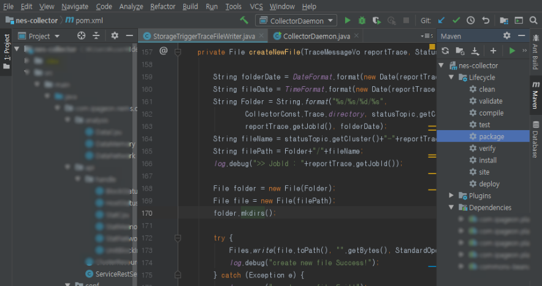
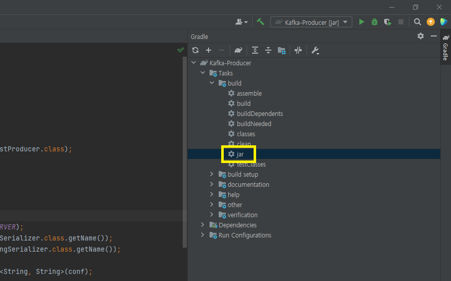
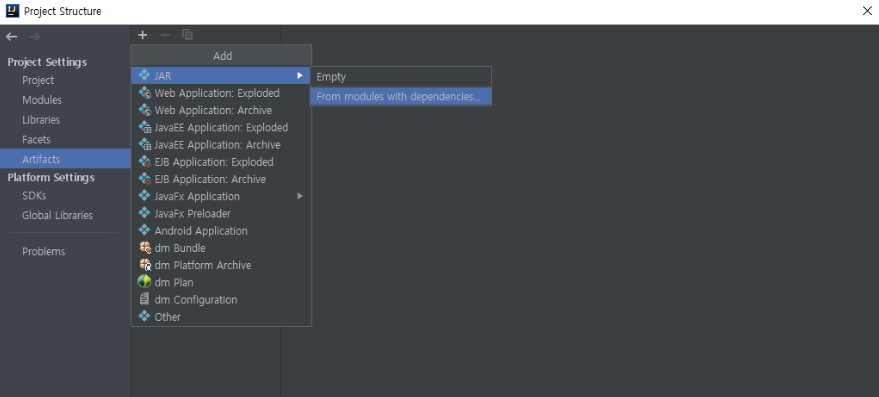

지적과 댓글은 언제나 환영합니다!

<br/><br/>

## 들어가기에 앞서

이 글은 jar 파일을 빌드하는 N가지 방법에 대해 다루고 있습니다.

IntelliJ 환경을 권장하며, Terminal로 빌드하는 방법도 추가했습니다.

(만약, 빠진 부분이나 추가로 알고 계시는 방법이 있다면 댓글로 부탁드립니다!)

<br>

---

## Jar 파일이란?

<br>

JAR(Java Archive)는 여러개의 자바 클래스 파일과,

클래스들이 이용하는 관련 리소스(텍스트, 그림 등) 및 메타데이터를 하나의 파일로 모아서 

자바 플랫폼에 응용 소프트웨어나 라이브러리를 배포하기 위한 소프트웨어 패키지 파일 포맷이다.

<br>

---

### **1. 빌드도구가 `Maven`인 경우**

<br>

IntelliJ에서 아래 화면과 같이 

`Maven` → `Lifecycle` → `package` 명령어를 실행(더블클릭)하면 



빌드 결과물이 \build\libs 경로 jar파일로 생성된다.

끝이다.

간단하지 않은가?

<br>

---

### **2. 빌드도구가 `Gradle`인 경우**

IntelliJ에서 아래 화면과 같이 

`Gradle` → `Tasks` → `build` → `jar` 명령어를 실행(더블클릭)하면 



빌드 결과물이 \build\libs 경로 jar파일로 생성된다.

끝이다.

간단하지 않은가?

<br>

---

### **3. 나는 통일된 방법을 사용하고 싶어요!(Artifacts 사용)**

좌측 상단 메뉴에서

`File` > `Project Structure` > `Artifacts` > `+` > `JAR` > `From modules with dependencies`를 선택한다.



<br>

실행할 메인 클래스를 지정해주고

`extract to the target JAR` 버튼을 선택하고 OK를 눌러 적용하자.


<br>


<br>

---

### **4. IntelliJ가 아니에요!(Terminal 사용)**

<br>

이 명령어를 실행하면 \_\_위치에 jar파일이 생성된다.

이 파일을 Docker에서 이미지로 만들면 끝이다.


_출처_

_[leeminee님 블로그](https://mynameisleeminee.tistory.com/6)_

_[ksr930님 블로그](https://ksr930.tistory.com/204)_


<br/>

---

```toc

```
