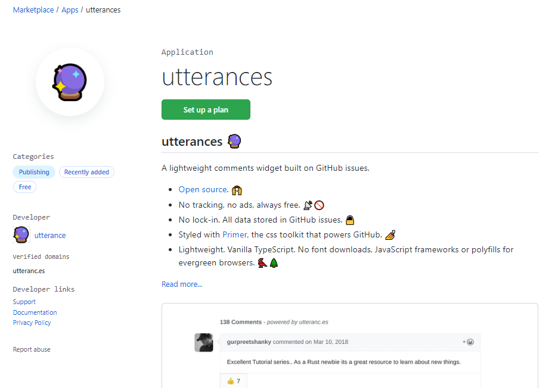
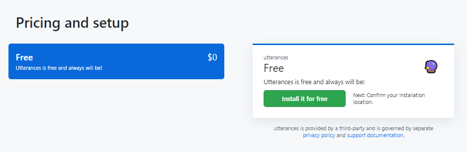
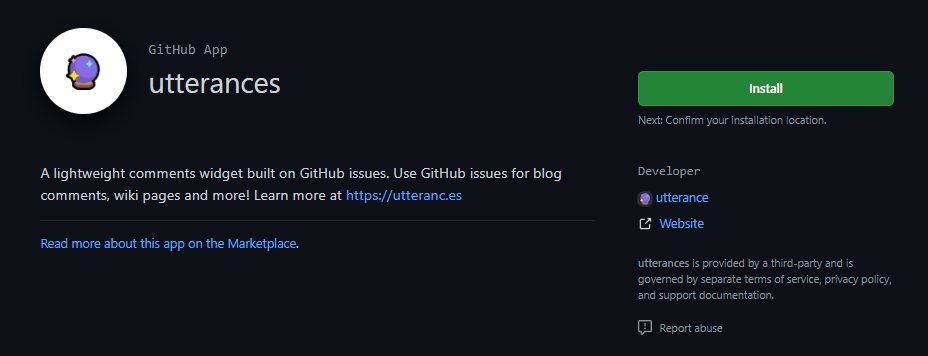
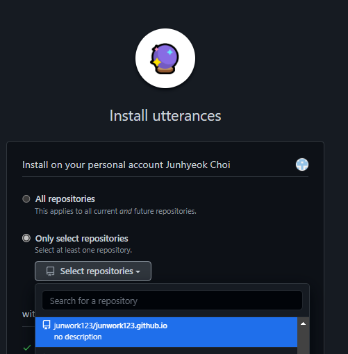

## 블로그에 댓글 기능을 추가해보자

우리가 선택할 수 있는 패키지는 다음과 같다.

### `disqus`

### `utterances`

필자는 disqus는 광고가 달리는 댓글 서비스여서 배제하고

utterances를 이용해보고자 한다.

<br/><br/>

## Github App 설치하기

먼저 깃허브 Marketplace > Apps > utterances를 검색하거나

[utterances 설치페이지](https://github.com/apps/utterances)를 접속해보자








가격 플랜에 관한 설명이 나오지만 

`무료 앱`이기 때문에 걱정말고 설치해주자

<br/><br/>



자신의 사이트가 있는 레포지토리에 설치해주면 된다.

<br/><br/>


```toc

```