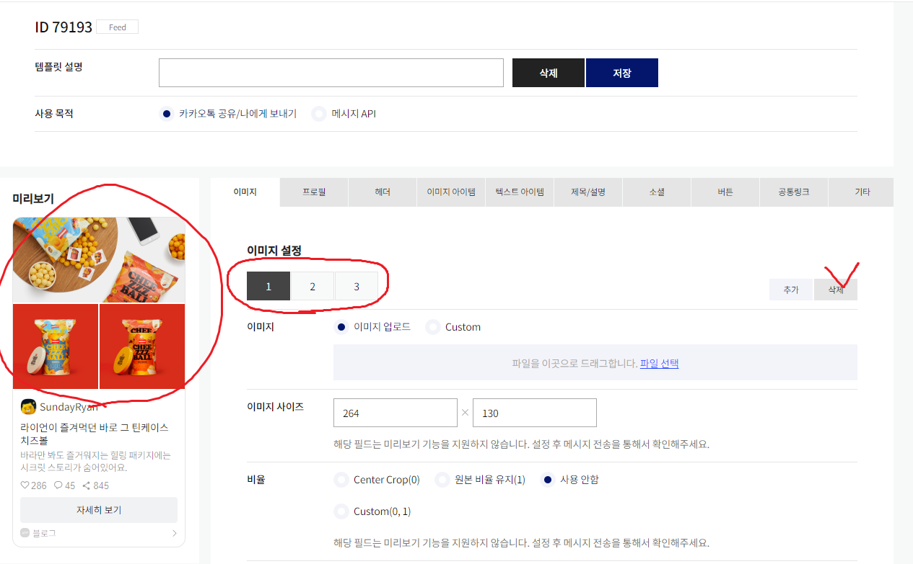
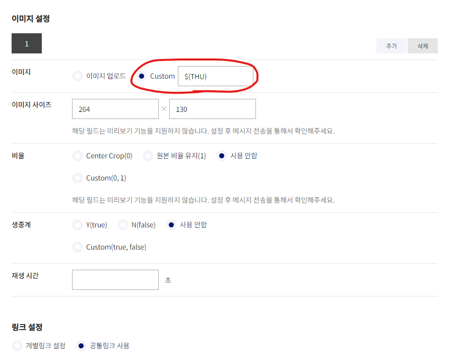

## **버튼 템플릿 만들기**



먼저 `가장 왼쪽에 보이는 것`이 우리가 보낼 `메시지의 최종 모습`이다.

이미지 3개가 있는 것이 눈에 띌 텐데

우리는 일단 한가지 이미지만 사용할 예정이므로 2개정도는 삭제해주자

 썸네일에 `한가지 이미지만 사용한다면(로고 삽입)`

`이미지 업로드`에 이미지를 삽입해주자




만약 그때 그때 썸네일을 바꿔주고 싶다면

`Custom`을 눌러서 썸네일로 지정할 변수명을 적어주자

이 변수명은 ${변수명} 형태로 페이지에 삽입하면 사용할 수 있다.

```html

```


<br/><br/>

---


*다음 2편에 계속..*


참고자료 출처

[[Github Blog] 깃허브 블로그에 카카오페이,토스 Buy me a coffee 후원버튼 달기](https://devyuseon.github.io/github%20blog/add-kakaopay-donate/)


```toc

```