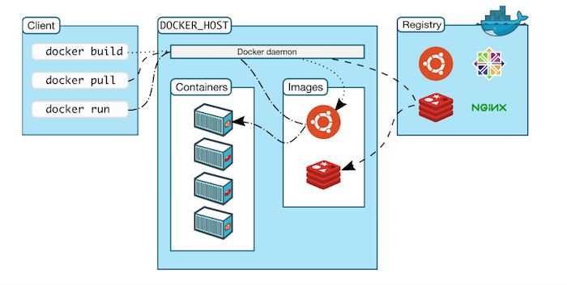

지적과 댓글은 언제나 환영합니다!

<br/>

---

## 목표

도커 개선하기에서 작성한 내용을 발전시켜보자.

<br>

크게 두 파트로 나눠 발전시켜보고자 한다.

- 서비스와 운영의 분리

    - 소스 위치, 버전 정보를 서비스와 분리하자.

    - 서비스 실행환경 정보를 서비스와 분리하자.

    - Micro Service 간 연결 정보를 서비스와 분리하자.


- CI/CD (다음편)

    - release 브랜치에 push가 발생하면 docker 이미지로 배포할 수 있도록 하자

    - 배포 버전은 커밋ID를 넣을 수 있도록 하자

<br>

---

## 여정

### 컨테이너와 프로젝트 간 의존성 제거


1. docker 이미지를 Registry에 등록
    
    각 Dockerfile마다 Container Registry에 등록하여 이미지를 pull할 수 있도록 등록
    
    (아래 명령어들은 프로젝트 메뉴 > Packages and registries > Container Registry에서 복사 가능!)
    
    ```bash
    # Gitlab의 Private image hub에 저장할 수 있도록 로그인
    docker login registry.gitlab.com
    
    # Image naming convention에 따라 아래와 같이 Build 및 Push
    docker build -t <registry URL>/<namespace>/<project>/<image>:<tag> .
    docker push <registry URL>/<namespace>/<project>/<image>:<tag>
    ```
    
    
2. 기존 Docker 실행관련 정보 분리
    - Container 정보를 가지고 있는 Docker Compose용 Repository를 새로 생성함.
        
        → 서비스는 서비스에만 집중하기 위함 : MSA의 특징인 인터페이스 통신을 살려보자
        
        - 서비스와 DB : DB 관련 Container 정보를 몰라도 됨
        - 서비스와 서비스 : 다른 서비스 Container 정보를 몰라도 됨
    - 다음과 같은 구조를 가지게 됨
        - DB Dockerfile
            
            ```bash
            # Database
            FROM postgres:14
            
            ENV APPNAME DBinstaller
            ENV WORKDIR /home/$APPNAME
            WORKDIR $WORKDIR
            COPY conf $WORKDIR/conf
            
            # 타임존 설정
            RUN ln -snf /usr/share/zoneinfo/$TZ /etc/localtime \
                && echo $TZ > /etc/timezone
            
            # update 및 패키지 설치, init 명령어 등록
            RUN apt update \
                && apt install -y sudo sed \
                && cat $WORKDIR/conf/init.sh >> /bin/init \
                && chmod u+x /bin/init
            ```
            
        - 환경변수 설정파일(Compose / DB)
            - .env 파일(Docker Compose용)
                
                ```bash
                # .env
                # IMAGE=<registry URL>/<namespace>/<project>/<image>
                # VERSION=<tag>
                
                # DB Configuration
                DB_IMAGE=registry.gitlab.com/...
                DB_VERSION=latest
                DB_HOST=0.0.0.0 # 외부 DB와 연결하고 싶을 때 DB IP 입력
                DB_ENV_FILE=.env.db.postgres
                
                # SERVICE_B Configuration
                SERVICE_B_IMAGE=registry.gitlab.com/..SERVICE_B..
                SERVICE_B_VERSION=latest
                SERVICE_B_IP=0.0.0.0 # 관리도구를 실행할 호스트의 IP로 변경
                SERVICE_B_NAME=SERVICE_B1
                
                # SERVICE_D Configuration
                SERVICE_D_IMAGE=registry.gitlab.com/..SERVICE_D..
                SERVICE_D_VERSION=latest
                SERVICE_D_NAME=kit1
                
                # Ports
                DB_PORT_IN=5432
                DB_PORT_OUT=5432
                SERVICE_B_PORT_IN=8080
                SERVICE_B_PORT_OUT=8080
                SERVICE_D_PORT_IN=8888
                SERVICE_D_PORT_OUT=8888
                SERVICE_D_CACHE_PORT_IN=8900
                SERVICE_D_CACHE_PORT_OUT=8900
                ```
                
            - .env.db 파일(DB용)
                
                ```bash
                # DB Configuration
                DB_NAME="sf1_db"
                DB_SCHEMA_NAME="sf1_schema"
                DB_USER=postgres
                DB_PASSWORD=0000
                TZ=Asia/Seoul
                
                # Postgresql
                POSTGRES_PASSWORD=${DB_PASSWORD}
                DB_KIND=postgresql # oracle, tibero
                DB_DIALECT="org.hibernate.dialect.PostgreSQL10Dialect"
                DB_DRIVER_CLASS_NAME="org.postgresql.Driver"
                DB_TYPE="postgresql_table"
                ```
                
        - Docker Compose
            - Docker-compose.yml
                
                ```bash
                # Docker compose
                services:
                    database:
                        env_file: ${DB_ENV_FILE}
                        image: ${DB_IMAGE}:${DB_VERSION}
                        container_name: db_instance
                        restart: unless-stopped
                        ports:
                          - ${DB_PORT_IN}:${DB_PORT_OUT}
                        volumes:
                          - sf1_db_storage:/var/lib/postgresql/data
                        healthcheck:
                          test: ["CMD", "pg_isready", "-U", "postgres"]
                          interval: 10s
                          timeout: 3s
                          retries: 3
                
                    SERVICE_B:
                        env_file: ${DB_ENV_FILE}
                        image: ${SERVICE_B_IMAGE}:${SERVICE_B_VERSION}
                        container_name: SERVICE_B
                        restart: always
                        depends_on:
                          database:
                            condition: service_healthy
                        ports:
                          - ${SERVICE_B_PORT_IN}:${SERVICE_B_PORT_OUT}
                        environment:
                          NODENAME: ${SERVICE_B_NAME}
                          DB_PORT: ${DB_PORT_OUT}
                          DB_HOST: db_instance
                
                    SERVICE_D:
                        env_file: ${DB_ENV_FILE}
                        image: ${SERVICE_D_IMAGE}:${SERVICE_D_VERSION}
                        container_name: SERVICE_D
                        restart: always
                        depends_on:
                          database:
                              condition: service_healthy
                        ports:
                          - ${SERVICE_D_PORT_IN}:${SERVICE_D_PORT_OUT}
                          - ${SERVICE_D_CACHE_PORT_IN}:${SERVICE_D_CACHE_PORT_OUT}
                        environment:
                          NODENAME: ${SERVICE_D_NAME}
                          DB_PORT: ${DB_PORT_OUT}
                          DB_HOST: db_instance
                          SERVICE_B_IP: ${SERVICE_B_IP}
                volumes:
                  sf1_db_storage:
                    driver: local
                ```
                
            - Docker-compose.external-db.yml
                
                ```bash
                # Docker compose
                services:
                  SERVICE_B:
                    env_file: ${DB_ENV_FILE}
                    image: ${SERVICE_B_IMAGE}:${SERVICE_B_VERSION}
                    container_name: SERVICE_B
                    restart: always
                    ports:
                      - ${SERVICE_B_PORT_IN}:${SERVICE_B_PORT_OUT}
                    environment:
                      NODENAME: ${SERVICE_B_NAME}
                      DB_PORT: ${DB_PORT_OUT}
                      DB_HOST: ${DB_HOST}
                
                  SERVICE_D:
                    env_file: ${DB_ENV_FILE}
                    image: ${SERVICE_D_IMAGE}:${SERVICE_D_VERSION}
                    container_name: SERVICE_D
                    restart: always
                    ports:
                      - ${SERVICE_D_PORT_IN}:${SERVICE_D_PORT_OUT}
                      - ${SERVICE_D_CACHE_PORT_IN}:${SERVICE_D_CACHE_PORT_OUT}
                    environment:
                      NODENAME: ${SERVICE_D_NAME}
                      DB_PORT: ${DB_PORT_OUT}
                      DB_HOST: ${DB_HOST}
                      SERVICE_B_IP: ${SERVICE_B_IP}
                ```
                
    - Compose 동작 확인
        
        ```bash
        # 기존과 똑같이 실행
        docker-compose up -d
        
        # 외부 DB 실행
        # docker compose -f .\docker-compose-external-db.yml up -d
        
        # DB 컨테이너에서 스크립트 실행
        docker exec -it db_instance init
        
        # 종료
        docker compose down -v
        ```
        
<br>

---

## Q & A

- DinD vs DooD의 차이가 뭔가요?
    
    
    
    > Docker는 위와 같이 3가지 유닛(Client, Host(Daemon), Registry) 으로 분리된다.
    > 
    - DinD(Docker in Docker)
        
        도커 컨테이너 내부에 호스트 도커 데몬과는 별개의 새로운 도커 데몬을 실행시키는 것이다. DinD를 이용하기 위해서는 새로운 도커 데몬 컨테이너를 실행시킬 때, --privileged 옵션을 사용하게 된다. 이 옵션은 컨테이너가 호스트 머신의 대부분의 권한을 얻을 수 있게 해준다. 이는 보안상 대부분의 권한을 획득하기 때문에 DinD는 권장하지 않는 방법이 되었다.
        
    - DooD (Docker Out Of Docker)
        
        호스트 도커 데몬이 사용하는 소켓을 공유하여 도커 클라이언트 컨테이너에서 컨테이너를 실행시키는 것이다. 이 방법은 도커 클라이언트 컨테이너에 --privileged 옵션을 주지 않았기 때문에 DinD보다는 안전하다. 하지만 컨테이너 이름 충돌, 포트 충돌 가능성이 있고, 소켓 마운트 경로가 호스트에 의존하게 된다는 단점이 있다.
        
    
- Compose CLI 커맨드 --env-file 옵션 vs Compose파일의 env_file 옵션의 차이가 뭔가요?
    - --env-file : Docker compose 파일 안에서 env파일을 환경변수로 참조할 수 있게 해준다.
    - env_file : 해당 env파일의 환경변수는 compose 파일에서 참조할 수 없으며, Dockerfile 내에서만 유효하다.
        
        ```bash
        # env_file 옵션은 아래와 같은 효력을 지닌다.
        docker run --env-file=FILE …
        ```

<br>

---

## 마치며

다음편은 대망의 마지막편으로

CI/CD를 통해 지금까지 했던 작업을 자동화해볼 것이다.

release 브랜치에 push가 발생하면 docker 이미지로 배포함으로써

Micro Service 갯수만큼 Docker Build - Push하는 반복작업을 최소화해보자.


<br>

---

_참고자료_

_[DinD(docker in docker)와 DooD(docker out of docker) | 아이단은 어디갔을까 (aidanbae.github.io)](https://aidanbae.github.io/code/docker/dinddood/)_

_[`.gitlab-ci.yml` 파일에 Docker 이미지 빌드 단계 추가 - GitLab CI Workshop (infograb.io)](https://workshop.infograb.io/gitlab-ci/33_add_docker_build_stage/2_add_build_stage/)_

_[CI/CD 프로세스 구축기 2. 파이프라인 구성 | by kyeong su kim | 월요일 오후 9시 | Medium](https://medium.com/monday-9-pm/ci-cd-%ED%94%84%EB%A1%9C%EC%84%B8%EC%8A%A4-%EA%B5%AC%EC%B6%95%EA%B8%B0-2-f96b1217279e)_

_[GitLab Runner 를 사용하여 GitLab CI 구성하기 (tistory.com)](https://hihellloitland.tistory.com/65)_

_[[Gitlab-CI/CD] window에서 Gitlab CI/CD를 docker로 배포하는 방법 (tistory.com)](https://otrodevym.tistory.com/entry/CICD-window%EC%97%90%EC%84%9C-Gitlab-CICD%EB%A5%BC-docker%EB%A1%9C-%EB%B0%B0%ED%8F%AC%ED%95%98%EB%8A%94-%EB%B0%A9%EB%B2%95)_

_[[GitLab] docker-compose를 이용하여 GitLab Runner추가하기 (tistory.com)](https://yoonsu.tistory.com/25)_

_[[Gitlab] CI/GitLab Container Registry (tistory.com)](https://ekwkqk12.tistory.com/32)_


---

```toc

```
