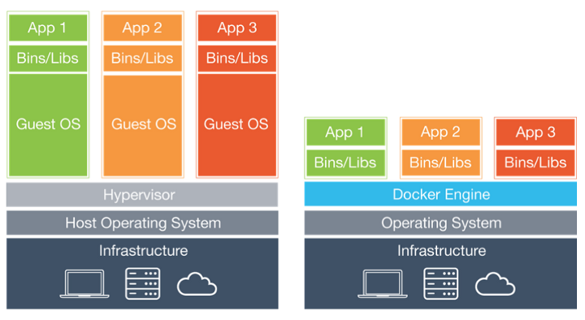
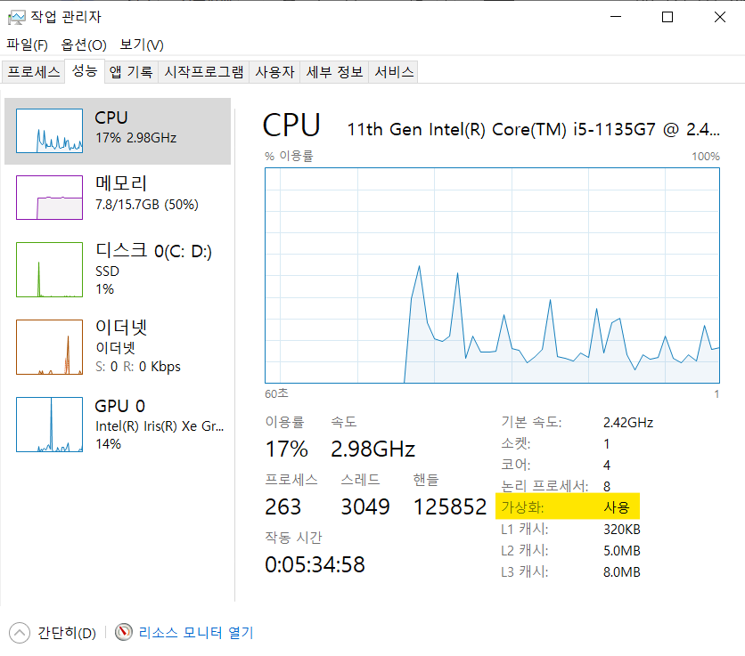

지적과 댓글은 언제나 환영합니다!

<br/><br/>


_예.. 그 드립 맞습니다..!_

인텔리제이에서 Spring Boot 프로젝트를 Docker로 이미지화 하기

<br>

---

## **도커와 컨테이너, VM(Virtual Machine)**

<br>

### **도커(Docker)란?**

도커는 리눅스의 응용 프로그램들을 프로세스 격리 기술들을 사용해

<u>컨테이너(Container)</u>로 실행하고 관리하는 오픈소스 프로젝트이다.

<br>

### **<u>컨테이너(Container)</u>란?**

컨테이너는 격리된 공간에서 프로세스가 작동하는 기술이다.

여기에는 <u>코드, 런타임, 시스템 도구, 시스템 라이브러리 등</u> 서버에 설치되는 무엇이든 포함될 수 있다.

이는 <u>**실행 중인 환경에 관계 없이 언제나 동일하게 실행될 것을 보증**</u>한다.

<br>

---

## **기존 VM(Virtual Machine)과 컨테이너는 무슨 차이일까?**

<br>



VM(왼쪽)과 Docker(오른쪽)의 구성도

<br>

우리에게 익숙한 [VMware](http://www.vmware.com/)나 [VirtualBox](https://www.virtualbox.org/)같은 가상머신은

호스트 OS 위에 게스트 OS 전체를 가상화하여 사용하는 방식이다.

이 방식은 무겁고 느려서 운영환경에선 사용하기 어려웠다.

<br>

이를 개선하기 위해 등장한 것이 **컨테이너(Container)** 방식이다.

단순히 프로세스를 격리시키기 때문에

호스트 OS에서 게스트 OS를 오가는 VM방식보다 가볍고 빠르게 동작한다.

(어려운 말로 Context Switching의 Overhead가 적다!)

<br>

하나의 서버에 여러개의 컨테이너를 실행하면

서로 영향을 미치지 않고 독립적으로 실행되어

기존 VM과는 다르게 성능적으로도 거의 손실이 없다.

(물론 네트워크 통신으로 인한 손실은 일부 있다!)

<br>

---

## 도커 작동방식

<br>


<br>

도커에서 가장 중요한 개념은 컨테이너와 <u>이미지(Image)</u>이다.

<u>이미지(Image)</u>는 **컨테이너 실행에 필요한 파일과 설정값등을 포함하고 있는 일종의 템플릿이다.**

도커 이미지 자체는 시작하거나, 실행할 수 없다.

컨테이너를 생성하면 불변 이미지(immutable image) 위에 쓰기 가능한 레이어가 추가되는 것뿐이다.

즉, 프로그램과 프로세스의 차이처럼 컨테이너는 이미지를 실행한 상태라고 볼 수 있다.

<br>

이미지의 종류는 OS, DB, VCS, 라이브러리, 프레임워크, 언어 등 다양한 종류를 포함할 수 있다.

이렇게 다양한 종류의 이미지를 레이어(Layer)라고 하여, 불변 이미지로써 조합하여 사용할 수 있다.

Ubuntu + PostgreSql + Spring Boot의 조합을 담은 실행환경을 파일 하나로 공유하고 실행을 보증할 수 있다.

<br>

생각해보라.

개발환경에서 설치하고, 환경변수를 세팅하고,

의존성 추가 등 설치에 들어가는 시간과 비용을 줄일 수 있고, 1초만에 복제하고 확장할 수 있다.

몇 기가짜리 파일을 계속 주고 받을 필요도 없다.

<br>

또한, Docker 위에 올라간 어플리케이션을 수정하면, 수정한 읽기/쓰기 레이어만 바꾸면 된다.

Docker는 이미지 레이어를 그대로 사용하면서

컨테이너가 실행중에 생성하는 파일이나 변경된 내용은

읽기/쓰기 레이어에 저장되므로 여러개의 컨테이너를 생성해도 최소한의 용량만 사용한다.

<br>

---

## 도커 설치

<br>

도커 설치는 간단한 편이므로 운영체제에 맞게 짧고 빠르게 넘어가도록 하자.

<br>

### **윈도우**



<br>

방법1. Hyper-V를 이용하는 방법(간단)

1. **작업관리자 > 성능**에서 가상화가 **'사용'**으로 되어있는지 확인한다.

2. **Window + S**를 눌러 **'Windows 기능'**을 검색 → **Hyper-V**를 체크하고 **확인**을 눌러 설치 → 재부팅

<br>

방법2. WSL2를 이용하는 방법

1. **Windows 기능 켜기/끄기**에서 **Linux용 Windows 하위 시스템, 가상머신 플랫폼**을 체크한다.

2. **Linux 커널 업데이트 패키지 [다운로드](https://wslstorestorage.blob.core.windows.net/wslblob/wsl_update_x64.msi) 및 실행**

3. **PowerShell에서 WSL 기본 버전을 2로 세팅한다.**

   ```powershell
   wsl --set-default-version 2
   ```

<br>

방법1 or 2를 완료했다면 아래 링크에서 도커 설치파일을 다운로드 받고 실행하자

[Install Docker Desktop on Windows | Docker Documentation](https://docs.docker.com/desktop/install/windows-install/)


**중간에 나오는 WSL2 관련 옵션도 체크해주자**

<br>

설치가 완료되면 **Close and log out**을 누르고 다시 윈도우에 로그인하고 약관에 동의하면 완료!

<br>

### **리눅스**

리눅스의 설치는 아래 명령어를 통해 간단히 설치할 수 있다!

```bash
curl -fsSL https://get.docker.com/ | sudo sh
```

<br>

다음편에서는 IntelliJ에서 SpringBoot를 Docker 이미지로 배포해보도록 하자.

<br>

---

<br>

_출처_

_[[Docker] 도커 시작하기 - 1. 도커 설치하기 (tistory.com)](https://da2uns2.tistory.com/entry/Docker-%EB%8F%84%EC%BB%A4-%EC%8B%9C%EC%9E%91%ED%95%98%EA%B8%B0-1-%EB%8F%84%EC%BB%A4-%EC%84%A4%EC%B9%98%ED%95%98%EA%B8%B0)_

_[[Kubernetes] 쿠버네티스 윈도우에 설치하기 (Docker Desktop) (tistory.com)](https://onu0624.tistory.com/102)_

_[초보를 위한 도커 안내서 - 도커란 무엇인가? (subicura.com)](https://subicura.com/2017/01/19/docker-guide-for-beginners-1.html)_

<br/>

---

```toc

```
