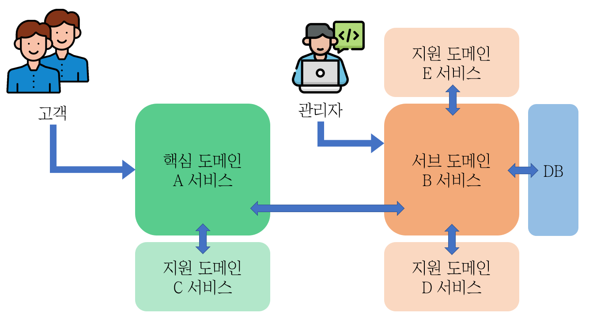

지적과 댓글은 언제나 환영합니다!

<br>

---


# 도커 삽질 개선하기

<br>

## 이전편 요약

이전 편 `도커 삽질하기` 에서는 단순 리눅스 컨테이너를 생성해서

직접 명령어를 타이핑하면서, 컨테이너의 상태를 변경하였다.

<br>

그 결과, 컨테이너가 재부팅되면 대부분의 데이터와 상태가 소실되어

같은 과정을 반복해야 했다.

<br>

---

<br>

## 목표

도커 컨테이너 설정을 간소화, 자동화해보자



- 공통 설정 분리 → env 파일 생성

- DB에 대한 dockerfile 작성 → 이미지 생성

- Package(서브도메인B, 지원도메인D)에 대한 dockerfile 작성 → 이미지 생성

- docker-compose를 이용해서 실행

<br>

---

## 여정

1. env 파일로 설정 분리
    
    ```docker
    # Database Configuration
    # DATABASE_HOST=0.0.0.0 # 외부 DB와 연결하고 싶을 때 사용
    DATABASE_NAME=test
    DATABASE_USER=postgres
    DATABASE_PASSWORD=0000
    DATABASE_PORT=5432
    
    # 서비스B Configuration
    서비스B_IP=0.0.0.0 # 관리도구를 실행할 호스트의 IP로 변경
    서비스B_NAME=서비스B_1
    서비스B_PORT=8080
    
    # 서비스D Configuration
    서비스D_NAME=서비스D_1
    서비스D_PORT=8888
    서비스D_CACHE_PORT=8900
    ```
    
2. DB에 대한 dockerfile 작성
    - 외부 DB를 연결하는 경우
        
        → 따로 DB 설정 없이 env 파일에서 DB 설정만 변경하면 된다.
        
    - 컨테이너 내부 DB 이용하는 경우
    
    ```docker
    # Database
    FROM postgres:14
    
    ### 타임존 설정
    RUN ln -snf /usr/share/zoneinfo/$TZ /etc/localtime \
        && echo $TZ > /etc/timezone
    
    ### update 및 패키지 설치
    RUN apt update \
        && apt -y install ufw # vim git tar gzip build-essential curl alien
    
    ### /home/dev 폴더 생성
    # RUN mkdir /data
    WORKDIR /var/lib/postgresql/data
    
    #RUN ["ufw" ]
    #RUN ["cat", "/var/lib/postgresql/data/pg_hba.conf"]
    #RUN ["echo", "host all all $TO_OPEN_IP/0 trust", ">>", "/var/lib/postgresql/data/pg_hba.conf"]
    ```
    
3. 서비스B에 대한 dockerfile 작성
    
    ```docker
    ## APPLICATION
    FROM openjdk:8-jdk-alpine
    
    ENV APPNAME 서비스A
    
    WORKDIR /home/$APPNAME
    COPY ./target/lib /home/$APPNAME/lib
    COPY ./conf /home/$APPNAME/conf
    COPY  ./target/서비스B.jar /home/$APPNAME/lib/서비스B.jar
    
    ENTRYPOINT [ "java", "서비스B 실행 방법" ]
    ```
    
4. 서비스B`에 대한 dockerfile 작성
    
    ```docker
    FROM openjdk:8-jdk-alpine
    
    ENV APPNAME 서비스D
    
    WORKDIR /home/$APPNAME
    
    COPY ark  /home/$APPNAME/ark
    COPY conf /home/$APPNAME/conf
    COPY ./target/서비스D.jar /home/$APPNAME/app.jar
    
    ENTRYPOINT ["java", "서비스D" ]
    ```
    
5. docker-compose 작성
    
    ```bash
    version: '2'
    
    services:
      database:
          build:
              context: .
              dockerfile: Dockerfile-db
          image: mypg:7.1.0
          container_name: db_instance
          restart: always
          networks:
            - inner_network
          ports:
            - ${DATABASE_PORT}:${DATABASE_PORT}
          volumes:
            - /db_storage/postgresql/data:/var/lib/postgresql/data
          environment:
            POSTGRES_PASSWORD: ${DATABASE_PASSWORD}
            TZ: Asia/Seoul
    
      서비스B:
          build:
            context: .
            dockerfile: Dockerfile
          image: 서비스B:7.1.0
          container_name: 서비스B
          restart: always
          depends_on:
            - database
          networks:
            - inner_network
          ports:
            - ${서비스B_PORT}:${서비스B_PORT}
          environment:
            NODENAME: ${서비스B_NAME}
            DATABASE_HOST: db_instance
            DATABASE_NAME: ${DATABASE_NAME}
            DATABASE_USER: ${DATABASE_USER}
            DATABASE_PASSWORD: ${DATABASE_PASSWORD}
            DATABASE_PORT: ${DATABASE_PORT}
    
      서비스D:
          image: 서비스D:7.1.0
          container_name: 서비스D
          restart: always
          depends_on:
            - database
          networks:
            - inner_network
          ports:
            - ${서비스D_PORT}:${서비스D_PORT}
            - ${서비스D_CACHE_PORT}:${서비스D_CACHE_PORT}
          environment:
            NODENAME: ${서비스D_NAME}
            DATABASE_HOST: db_instance
            DATABASE_NAME: ${DATABASE_NAME}
            DATABASE_USER: ${DATABASE_USER}
            DATABASE_PASSWORD: ${DATABASE_PASSWORD}
            DATABASE_PORT: ${DATABASE_PORT}
            서비스B_IP: ${서비스B_IP}
    
    networks:
        inner_network:
            driver: bridge
    
    volumes:
        db_storage:
            driver: local
    ```
    
6. env 파일을 이용한 docker compose 실행
    
    ```docker
    # .env 파일은 그냥 실행해도 인식함
    docker compose up -d
    
    # .env 파일을 여러개 만들면 아래와 같이 실행
    docker compose --env-file .\db19.env up -d
    ```

<br>    

---

## Q & A

- 볼륨을 여러곳에서 같이 쓰고 싶어요
    
    volumes을 공유해서 사용할시 주의할 점은 
    
    공유할 볼륨의 이름을 컨테이너에 명시하는 것 뿐만 아니라 경로도 같아야 한다는 점입니다.
    
    nodejs 컨테이너의 볼륨의 경로가 만약 아래처럼 변경된다면
    
    ```
    - shared-data:/test/nodejs
    ```
    
    db 컨테이너의 볼륨의 경로도 아래처럼 바꿔줘야지만 
    
    같은 볼륨을 두 컨테이너에서 동시에 사용할 수 있습니다.
    
    ```
    - shared-data:/test/mysql
    ```

<br>

- 현재 상태를 이미지로 저장하고 싶어요
    
    ```bash
    # 호스트 OS에서
    docker commit -m "메시지" 컨테이너명 이미지명:태그
    ```

<br>

- docker-compose vs docker compose, 무슨 차이인가요?
    
    docker-compose : 구버전, python 기반
    
    docker compose : 신버전, Go언어 기반 + 신규 명령어 추가
    
    실행 속도는 비슷하다.
    
<br>

---

<br>

_참고자료_

_[[Docker-Basic (10)] Docker File 사용하기 - 실습2 MARIA DB (tistory.com)](https://1mini2.tistory.com/31)_

_[Dockerfile에서 자주 쓰이는 명령어 | Engineering Blog by Dale Seo](https://www.daleseo.com/dockerfile/)_

_[최고의 Dockerfile 작성을 위한 몇 가지 습관들 (velog.io)](https://velog.io/@seheon99/%EC%B5%9C%EA%B3%A0%EC%9D%98-Dockerfile-%EC%9E%91%EC%84%B1%EC%9D%84-%EC%9C%84%ED%95%9C-%EB%AA%87-%EA%B0%80%EC%A7%80-%EC%8A%B5%EA%B4%80%EB%93%A4)_

_[[Dockerfile] Dockerfile이란? Dockerfile 옵션 — 시간이 멈추는 장소 (tistory.com)](https://narup.tistory.com/204)_

_[Dockerfile 작성방법 및 읽는 법 · MinhoPark (mino-park7.github.io)](https://mino-park7.github.io/docker/2018/12/10/dockerfile/)_


```toc

```
