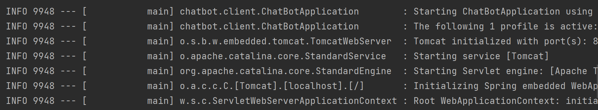
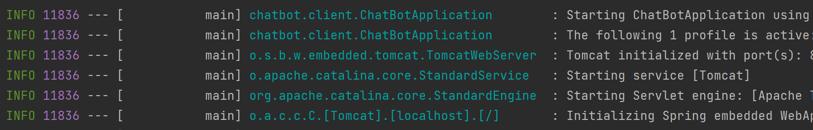

지적과 댓글은 언제나 환영합니다!

<br/><br/>

# 스프링 로그(Log)를 파일로 남겨보자

<br/>

## **로그는 왜 쓸까?**

로그는 소프트웨어의 이벤트를 기록하는 것으로

Debug나 단순 콘솔 출력(print)에 비해 아래와 같은 장점이 있다.

    1. 자유로운 출력 위치와 형식
    2. 로그 레벨*에 따라 메시지 분리 가능
        *Log Level : Fatal, Error, Warn, Debug, Info 등...
    3. 큰 코드 변경없이 환경조성 가능

<br>

그렇다면 스프링에서 로그에 대해 어떤 방법을 사용할 수 있을까? 

<br>

---

## 두 가지 선택지

<br>

2022년 현재, 스프링에서 가장 널리 쓰이는 인터페이스는 

slf4j이다.

`라이브러리`가 아니라 `인터페이스`이다.

이 slf4j를 기반으로 구현한 `라이브러리`는 

대표적으로 `logback`과 `log4j2`가 있다.

간략하게 차이점을 알아보자면

    logback : Spring boot 기본 내장, 서버 재시작없이 설정변경 가능

    log4j2 : 비동기 로그 출력 가능, 지연 연산* 가능, 멀티 쓰레드에서 우수함
        *지연 연산(Lazy Evaluation) : 값 계산을 실행 직전까지 최대한 늦추는 기법


<br>

자, 그렇다면 스프링에서 어떻게 사용할 수 있을까?

<br>

---

## 실제 사용해보자

<br>

필자는 스프링에서 아래와 같이 사용하고 있다.

```java
@Slf4j
@Service
public class PingPongService implements ChatBotService {
    @Override
    public Optional<MessageTemplate> makeResponse{
        ...
        log.info("content = {}", content);
        ...
    }
}
```

위 코드에서 딱 2가지만 확인하면 된다.

첫 시작의 `@Slf4j`와 `log.info()`다.

<br>

`@Slf4j` 어노테이션은 인터페이스로써

현재 클래스에 큰 구조 변경없이 log 구현체를 추가해준다.

(이 때, `logback 구현체가 default`로 사용된다.)

<br>

즉, `log`라는 멤버변수를 통해 

`log.info()`, `log.debug()`, `log.error()` 등 

`로그 관련 함수를 사용`할 수 있게 된다.



위 결과화면을 보면 로그가 잘 출력된다. 

(의미는 조금 뒤에!)

<br>

그렇지만 한눈에 안들어오기도, 조금 심심하기도 하다.

좋은 방법이 없을까?

<br/>

## **로그에 색을 입혀보자**

`application.properties`에 가서

아래 옵션을 넣어보자

```yml
#로그 색상 출력
spring.output.ansi.enabled=always
```

<br>



어떠한가?

로그가 한눈에 잘 들어온다.

로그의 의미를 살펴보자면

일반적으로 왼쪽부터 순서대로

`시간` - `로그레벨` - `프로세스번호` - `실행위치(클래스)` - `로그내용` 이다.

색상과 순서를 변경할 수 있기도 하고,

의미는 명확하기 때문에 어떤 항목이 있는지만 알면 된다.

`(외울 필요 X)`

<br>

한편, 이런 생각을 해보자

이 로그를 항상 쳐다보고 있어야 하는걸까?

한달 전 로그를 다시 볼 순 없을까?

<br>

---

## **로그를 파일로 출력해보자**

<br>

`application.properties`와 같은 위치에

`logback.xml`파일을 새로 만들어준다.

(`logback`이라는 이름에 따라서 설정이 적용되므로 주의하자)

<br>

아래 코드는 필자가 사용하는 `logback 설정`이다.

하나씩 의미를 알아보자

<br>

### 기본 설정 및 `라이브 리로드`

<br>

`configuration` 태그에 `라이브 리로드` 설정을 해줄 수 있다.

서버 재시작 없이 로그 관련 설정을 갱신해준다.

설정 변경 스캔 주기를 설정할 수 있다.

<br>

```xml
<configuration scan="true" scanPeriod="30 seconds">
    <!--여기에 내용 삽입 -->
</configuration>
```

<br>

`configuration` 태그 안에 

후에 나올 내용들을 넣어주면 된다. 

(직접 해보길 추천한다.)

<br>

### `콘솔 출력` 정의

<br>

`STDOUT`이라는 이름으로 `출력할 형식(appender)`을 정의했다.

`ConsoleAppender`로 콘솔에 출력하도록 했다.

`STDOUT`에 사용할 `메시지 형식(pattern)`을 정의했다.

`pattern`은 날짜 - 레벨 - 클래스 - 메시지 순이다.

(색상지정 등 자세한 설명은 [공식문서 참조](https://logback.qos.ch/manual/layouts.html#coloring))

```xml
    <!-- 콘솔 로그 설정 -->
    <appender name="STDOUT" class="ch.qos.logback.core.ConsoleAppender">
        <encoder>
            <pattern>%d{yyyy-MM-dd HH:mm:ss.SSS} %highlight(%-5level) %cyan(%logger{15}) : %msg%n</pattern>
        </encoder>
    </appender>
```

<br>

### `파일 출력` 정의

<br>

`LOGS_ABSOLUTE_PATH`라는 이름으로 출력 위치를 정해주었다.

`FILE`이라는 형식(appender)을 정의헀다.

`RollingFileAppender`로 파일에 출력하도록 했다.

`ThresholdFilter`필터로 DEBUG 레벨 이상만 출력하도록 헀다.

`file` 위치와 이름을 정해주었다.

`rollingPolicy`로 `TimeBasedRollingPolicy`를 지정했는데

이는 1개당 최대 100MB의 파일로 `(maxFileSize)`

최대 30개까지 로그를 유지하고 `(maxHistory)`

총합 3GB를 넘지 않도록 설정했다. `(totalSizeCap)`

`메시지 형식(pattern)`도 로그레벨 - 날짜 - 클래스 - 메시지 순으로 정의했다.

`이 때는 텍스트 파일 출력이므로, 색상을 지정할 수 없다.`

```xml
    <!-- 파일 로그 설정 -->
    <property name="LOGS_ABSOLUTE_PATH" value="./logs" />
    <appender name="FILE" class="ch.qos.logback.core.rolling.RollingFileAppender">
        <filter class="ch.qos.logback.classic.filter.ThresholdFilter">
            <level>DEBUG</level>
        </filter>
        <file>${LOGS_ABSOLUTE_PATH}/logback.log</file>
        <rollingPolicy class="ch.qos.logback.core.rolling.TimeBasedRollingPolicy">
            <!-- rollover daily -->
            <fileNamePattern>logback-%d{yyyy-MM-dd}.%i.log</fileNamePattern>
            <maxHistory>30</maxHistory>
            <totalSizeCap>3GB</totalSizeCap>
            <timeBasedFileNamingAndTriggeringPolicy
                    class="ch.qos.logback.core.rolling.SizeAndTimeBasedFNATP">
                <!-- or whenever the file size reaches 100MB -->
                <maxFileSize>100MB</maxFileSize>
            </timeBasedFileNamingAndTriggeringPolicy>
        </rollingPolicy>
        <encoder>
            <pattern>[%-5level] %d{HH:mm:ss.SSS} %logger{36} - %msg%n</pattern>
        </encoder>
    </appender>
```

<br>

### 출력 설정

기본적으로 출력할 로그레벨은 `DEBUG` 이상으로 지정했다.

이 때, 위에서 정의한 `STDOUT`형식으로 콘솔 출력을,

`FILE` 형식으로 파일 출력을 할 수 있도록 했다.

logger는 특정 패키지에만 적용할 수 있도록 하는 부분이다.

`응용하면 특정 패키지의 로그만 특정 파일에 출력하도록 할 수 있다.`

```xml
    <root level="DEBUG">
        <!--     참조할 appender 설정 - STDOUT -->
        <appender-ref ref="STDOUT" />
        <appender-ref ref="FILE" />
    </root>

    <!-- log 레벨 설정 (org.springframework=debug)
    <logger name="org.springframework" level="DEBUG">
        <appender-ref ref="FILE" />
    </logger>
    -->
```

<br>


### 마무리

logback.xml 완성 후 Spring을 실행해보면

최상위 위치에 `./logs` 폴더가 생기고

로그가 파일로 저장되는 것을 확인할 수 있다.

추가적으로 개발 환경마다(local, dev, product 등)

로그를 다르게 세팅하는 것도 가능하다.

한편, 오픈소스인 `LogStash`를 사용하면 

네트워크를 통해 로그를 저장하는 것도 가능하다. 

(추후 포스팅 예정)


_출처_

_[loosie님 블로그](https://loosie.tistory.com/829)_

_[minkwon4님 블로그](https://minkwon4.tistory.com/161)_

_[fwantastic님 블로그](https://www.fwantastic.com/2019/12/javautillogging-vs-log4j-vs-slf4j.html)
<br/>

---

```toc

```
