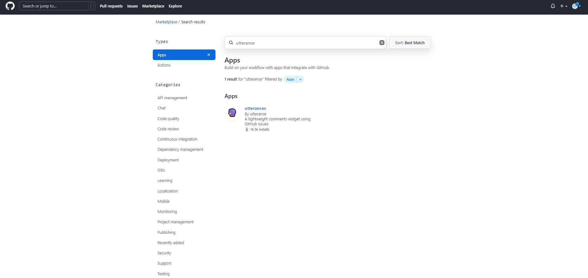
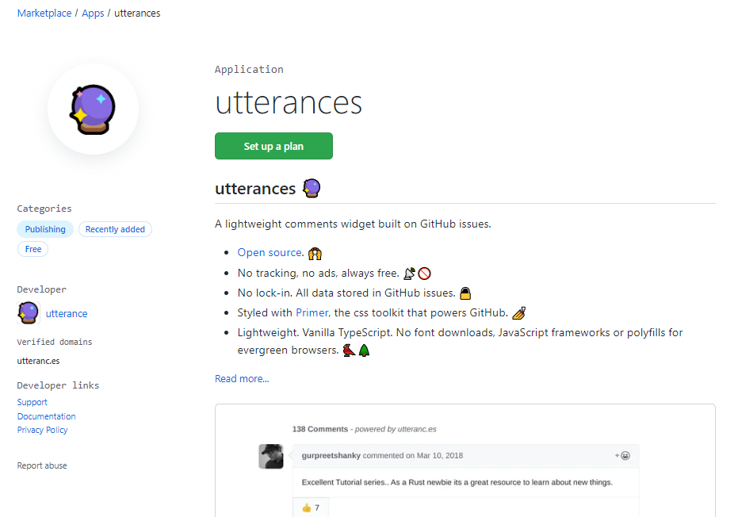
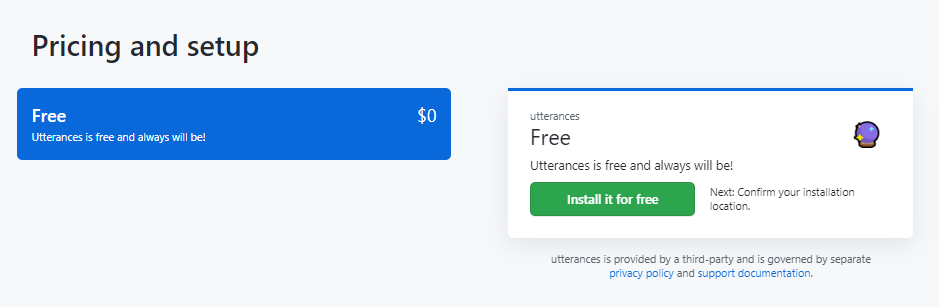
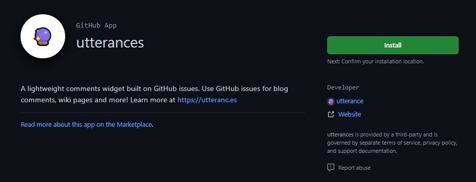
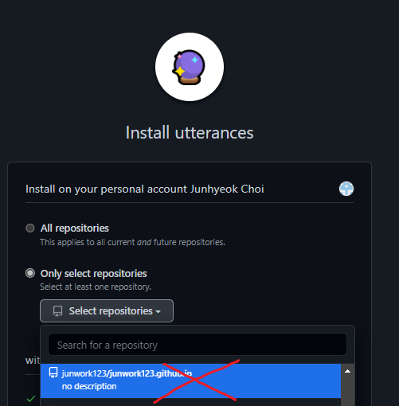
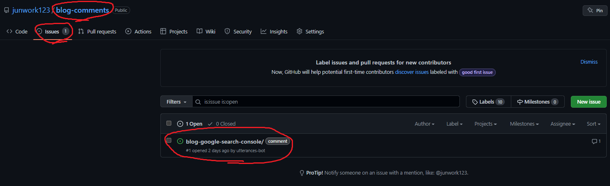
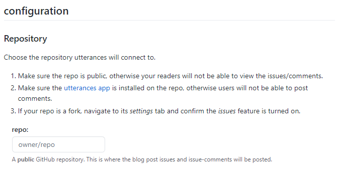
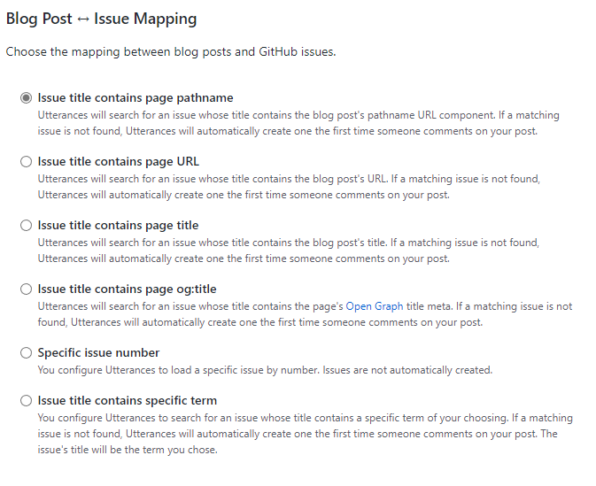
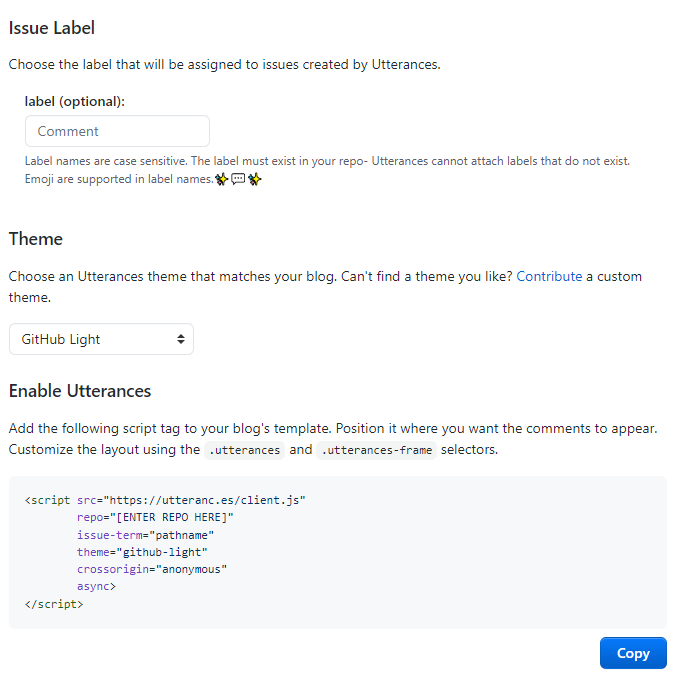
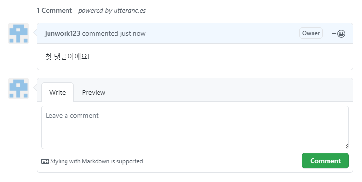

## 블로그에 댓글 기능을 추가해보자

우리가 선택할 수 있는 패키지는 다음과 같다.

### `disqus`

### `utterances`

필자는 disqus는 광고가 달리는 댓글 서비스여서 배제하고

utterances를 이용해보고자 한다.

<br/><br/>

## Github App 설치하기

먼저 깃허브 Marketplace > Apps > utterances를 검색하거나

[utterances 설치페이지](https://github.com/apps/utterances)를 접속해보자









가격 플랜에 관한 설명이 나오지만

`무료 앱`이기 때문에 걱정말고 설치해주자

<br/><br/>



`자신의 사이트가 있는 레포지토리`가 아니라

`새 레포지토리`를 만들어서 설치해주면 된다. ex) junwork123/blog-comments

<br/><br/>



왜냐면, utterance는 `깃허브의 issue기능을 기반`으로 동작한다.

댓글이 달리면 댓글용 레포지토리에

해당하는 포스트 이슈를 열고 댓글이 달리는 것처럼 내용이 연동되는 것이다.

<br/><br/>

이제 [utterance 홈페이지](https://utteranc.es/)에 접속해서

나만의 스크립트를 삽입해보자.

스크롤을 내리다가 `configuration`부터 시작하면 된다.



댓글을 달면 이슈를 생성할 레포지토리 설정 파트다.

`깃허브-아이디/댓글용-레포지토리-이름`을 입력하면 된다.

<br/><br/>



두번째는 블로그 포스팅과 이슈간 연동 방식이다.

`크게 바꾸지 않아도 무방하다.`

페이지 PATH로 연결할지 혹은

URL, 타이틀, Number, 특정키워드로 연동할지 선택할 수 있다.

<br/><br/>



issue label은 utterance bot이 동작할 때 사용할 라벨이다.

`빈칸으로 둬도 무방하다.`

직접 이슈 라벨을 설정할 수 있다.

미리 라벨을 생성해둬야 하며(대소문자 구분 O, 이모지 사용 가능)

<br/><br/>

Theme는 댓글부분의 테마다.

하나씩 눌러서 바꿔보고 `자신의 블로그에 맞는 테마를 고르자.`

<br/><br/>

Enable Utterance에서는

지금까지 설정한 내용이 스크립트로 제공된다.

이 내용을 블로그에 삽입하면 된다.

(필자는 Footer에 삽입했다.)



첫 댓글을 작성해봤다! ~~감격!~~

```toc

```
