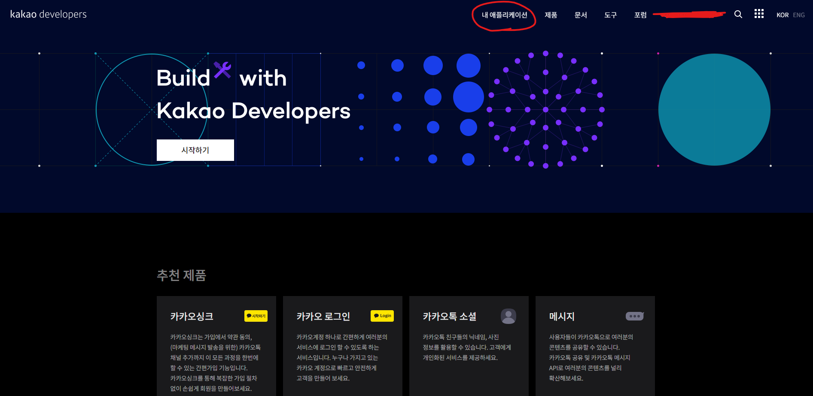
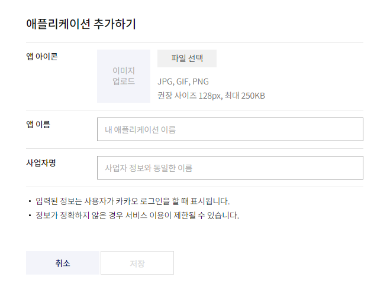
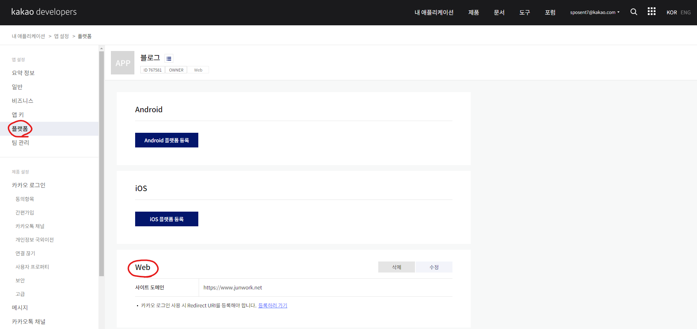
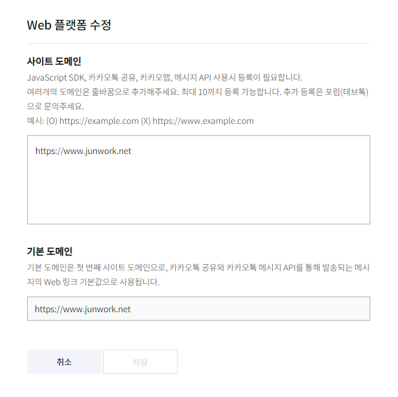
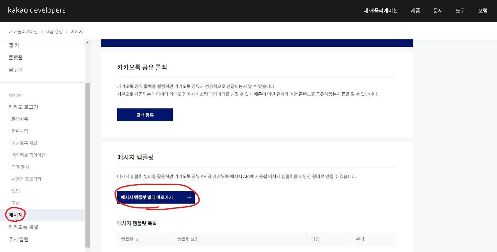
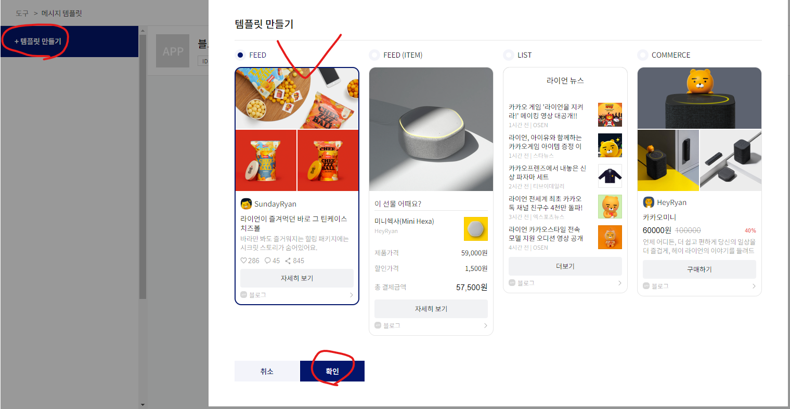
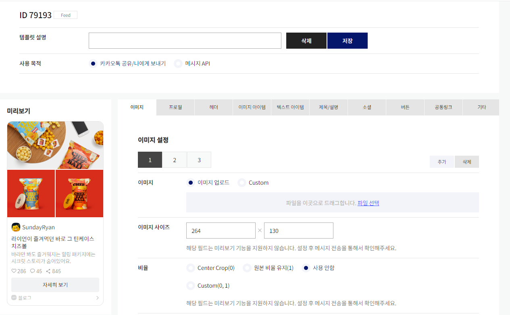

## **소셜기능**

우리 블로그의 글을 널리 퍼트릴 수 있도록

`소셜기능(공유하기)`를 넣어보자.

대표적으로 가장 많이 사용하는 `카카오톡 공유버튼`을

넣어보고, 이를 응용해서 `후원버튼`을 만들어 볼 것이다.

<br/><br/>

---


## **카카오 개발자센터**

우리는 먼저 [카카오 개발자센터](https://developers.kakao.com/)에서 

`도메인을 등록`하고, `메시지빌더로 템플릿`을 만들 것이다.







애플리케이션을 추가하려고 하면, 

앱이름과 사업자명을 적게 되어있는데 크게 신경쓰지않고 적어도 된다!

필자는 `'블로그' / 본명`으로 적고 넘어갔다.

<br/><br/>




애플리케이션을 생성하고 나면 

`플랫폼 메뉴`에서 자신의 블로그 주소를 적어주자.

이 때, https://블로그주소.com/ 에서 마지막 `/`는 빼줘야한다.

<br/><br/>




그러면 위와 같은 결과처럼 입력될 것이다.

이제 `메시지 빌더`를 통해 `나만의 공유하기 버튼`을 만들어보자

<br/><br/>






`스크린샷에 표시된 버튼`을 누르면서

`메뉴에 진입`하다보면 아래와 같은 화면이 나타난다.

<br/><br/>




수 많은 탭과 기능이 보이지만 

우리가 알아야 할 것은 `4가지 뿐`이다.

*[다음 2편]()에 계속..*

<br/><br/>


참고자료 출처

[Github Blog에 카카오톡 공유버튼 만들기](https://pozafly.github.io/blog/jekyll-kakao-share-button/)


```toc

```