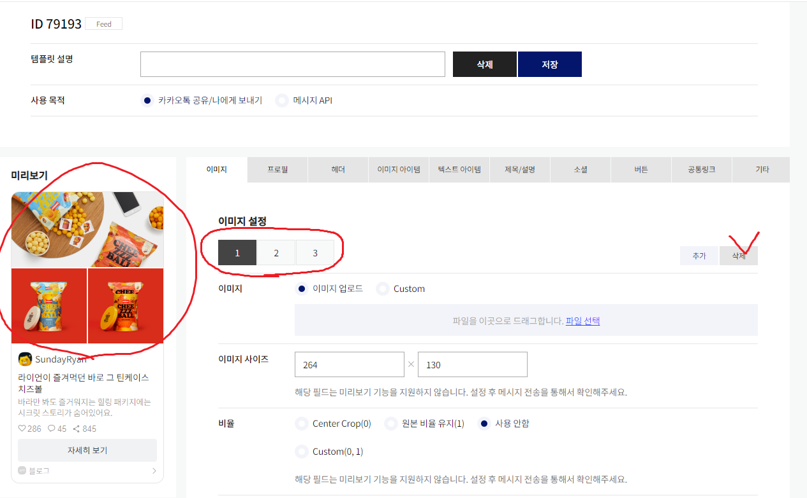
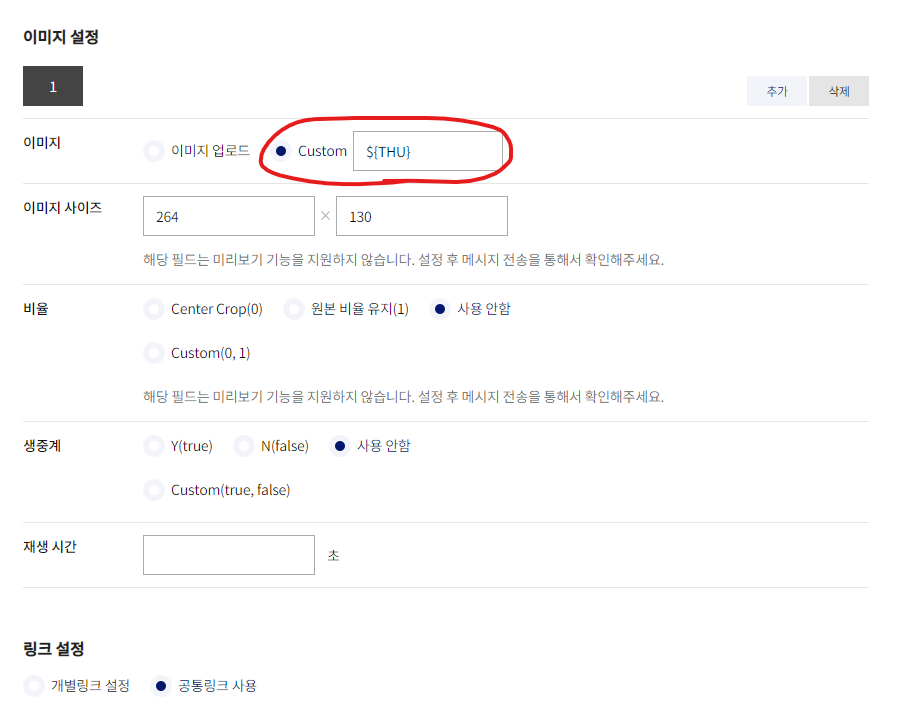
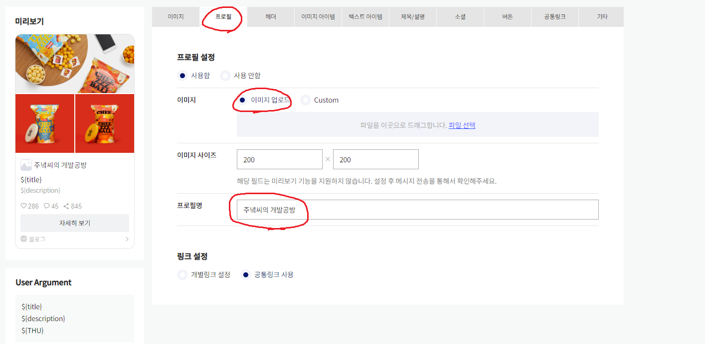
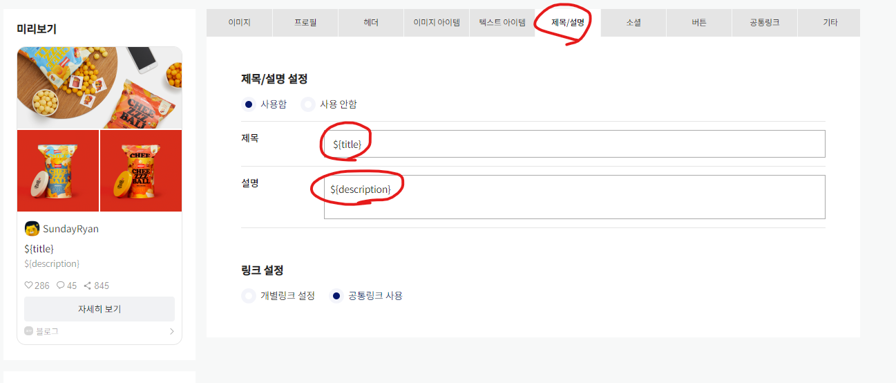
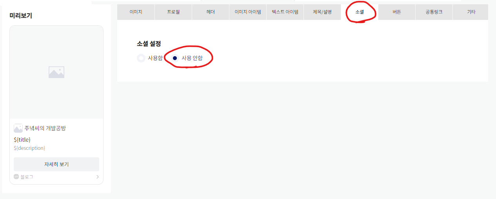
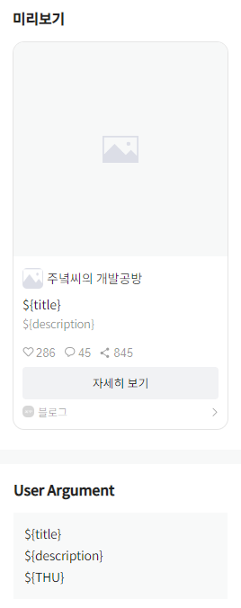

_[이전편 1편](https://www.junwork.net/blog-social-feature-button1/)에서 계속.._

## **버튼 템플릿 만들기**



먼저 `가장 왼쪽에 보이는 것`이 우리가 보낼 `메시지의 최종 모습`이다.

이미지 3개가 있는 것이 눈에 띌 텐데

우리는 일단 한가지 이미지만 사용할 예정이므로 2개정도는 삭제해주자

썸네일에 `한가지 이미지만 사용한다면(로고 삽입)`

`이미지 업로드`에 이미지를 삽입해주자

<br/><br/>



만약 `썸네일을 게시물마다` 바꿔주고 싶다면

`Custom`을 눌러서 썸네일로 지정할 변수명을 적어주자

이 변수명은 `${변수명}` 형태로 페이지 HTML에 삽입하면 사용할 수 있다.

일단은 마저 설정을 완료하자.

<br/><br/>



다음은 `프로필 탭`에서 표시될 소개를 적어보자

필자는 블로그명과 로고를 삽입했다.

여기도 변수명을 적을 수 있지만

로고는 쉽게 바뀌는 것은 아니므로 고정적으로 두었다.

<br/><br/>



다음은 `제목/설명`이다.

`제목에는 ${title}`, `설명에는 ${description}`을 적어주자

(변수명은 아무래도 좋다!)

<br/><br/>



마지막으로 소셜 탭에서는

좋아요, 조회수, 공유수를 설정할 수 있다.

여기도 마찬가지로 변수를 통해 노출시킬 수 있지만

블로그에 설치한 플러그인마다 설정된 변수명을 추출해야 한다.

이제 설정을 완료했으니 최종화면을 확인해보자.

<br/><br/>



`페이지 왼쪽 미리보기`를 보면

설정을 완료한 `실제 화면`을 볼 수 있다.

~~우리가 설정한 변수명으로 가득하다..~~

이제 <u>코드를 만지러 가볼 시간</u>이다.

변수명에 실제 값을 어떻게 넣는지 배워보도록 하자.

<br/><br/>

_다음 3편에 계속.._

---

참고자료 출처

[[Github Blog] 깃허브 블로그에 카카오페이,토스 Buy me a coffee 후원버튼 달기](https://devyuseon.github.io/github%20blog/add-kakaopay-donate/)

```toc

```
