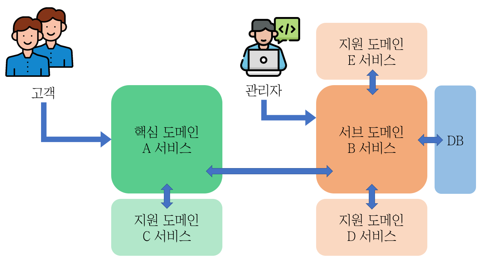

지적과 댓글은 언제나 환영합니다!

<br>

---

## 들어가기에 앞서..

<br>

    본 게시글은 MSA 형태로 구성된 서비스를 
    하나씩 도커라이징(dockerizing)하는 게시물입니다.

    도커 명령어를 배우는 초심자 입장에서 작성한 글로
    삽질했던 시간 순서대로 작성하였습니다.

    중급자 이상 분들은 필요한 명령어만 골라서 사용하시면 됩니다.

<br>

---

<br>

## 현재 상황

현재 가지고 있는 MSA 형태의 어플리케이션의 구조는 아래와 같다.



서비스 별로 실행파일이 분리가 되어 

API 요청으로 통신하고 있긴 하지만,

실행 시, 같은 디렉토리 내에서 상대위치 참조를 하고 있다.

즉, <u>물리적으로 분리가 어려운 상태</u>이다.

<br>

따라서, 단계적, 점진적으로 도커라이징하고자 한다.

<br>

## 목표

이번 글에서는 `최소한의 분리`를 하려고 한다.

- 어플리케이션(MSA를 통째로) 과 DB를 각각 컨테이너화

- 어플리케이션과 DB가 각각 다른 볼륨(Volume)을 가짐

- 같은 내부 네트워크로 연결

<br>

</aside>

## 여정

1. 이미지 검색
    
    ```bash
    # 도커 이미지 검색 - 다운로드 - 확인
    docker search ubuntu
    
    docker pull ubuntu:18.04
    
    docker images
    ```
    
<br>

2. 컨테이너 생성 및 실행
    
    ```bash
    # 컨테이너끼리 묶을 네트워크 생성
    docker network create ${네트워크 이름}
    
    # 컨테이너 생성 및 실행
    # 로컬 포트랑 겹치면 하나만 실행할 수 있으므로 주의
    docker run -i -t --network ${네트워크 이름} -p 8080:8080 -v D:\repo:/data --name ${컨테이너 이름} ubuntu:18.04 /bin/bash
        # -i : 사용자 입출력 가능 옵션
        # -t : Bash 사용
        # --network : 해당 네트워크에 연결
        # -p : 포트 포워딩 = ${호스트OS 접속포트}:${컨테이너 연결포트}
        # -v : 파일시스템 볼륨 연결 = ${연결할 호스트OS 디렉토리}:${연결될 컨테이너 디렉토리}
        # -d : Bast 미사용컨테이너를 데몬 프로세스 형태로 실행하여 유지
        # --name : 컨테이너 이름 지정
        # /bin/bash : 컨테이너가 지속적으로 실행할 파일을 지정한 것(변경 가능)
    
    # 실행중인 컨테이너 확인
    docker ps
    ```
    
    ```bash
    # 컨테이너 전체 목록 확인
    # (이전에 종료되었던 컨테이너 포함)
    docker ps -a
    
    # 기존에 생성되어 있는 컨테이너 시작
    docker start -i "컨테이너_이름"
    ```
    
<br>

3. 컨테이너 접속 및 종료
    
    ```bash
    # 호스트 OS에서
    # 컨테이너 접속
    docker attach "컨테이너_이름"
    
    # 컨테이너 종료
    docker stop "컨테이너_이름"
    
    # 컨테이너에 실행명령
    docker exec -it ${컨테이너 이름} 스크립트
    # -it : 컨테이너 지속연결 유지
    
    # 컨테이너에서
    # 호스트 OS로 복귀(컨테이너 유지)
    Ctrl + p, q
    
    # 컨테이너 종료
    exit / Ctrl + d
    ```
    
<br>

4. 컨테이너 볼륨
    
    ```bash   
    # 볼륨 생성
    docker volume create ${볼륨 이름}
    
    # 컨테이너에서 볼륨 마운트 해제(종료 먼저 필요)
    docker container rm ${볼륨 이름}
    
    # 볼륨 삭제
    docker volume rm ${볼륨 이름}
    ```

<br>

5. DB 컨테이너 생성
    
    ```bash
    # Postgres 이미지 받아오기
    docker image pull postgres:14
    
    # DB 컨테이너 생성
    # 로컬 DB랑 포트 겹치지 않게 주의!
    docker run --network sf1 -p 4321:5432 --name pg14 -e POSTGRES_PASSWORD=0000 -e TZ=Asia/Seoul -v /database/pgdata:/var/lib/postgresql/data -v D:\repo\Package\sf1-v7-package:/data/volume -d postgres:14 
    # docker run -p 5432:5432 --name pg14
    # -e POSTGRES_PASSWORD=0000
    # -e TZ=Asia/Seoul
    # -v /database/pgdata:/var/lib/postgresql/data -d
    # -v D:\repo\Package\sf1-v7-package:/data/volume
    # postgres:14
    
    # DB 컨테이너 접속
    docker exec -it pg14 /bin/bash
    ```
    
<br>

6. DB 설정
    
    ```bash
    # 외부 접속 허용
    sudo vi /var/lib/postgresql/data/postgresql.conf
    	listen_addresses = '*'
    
    sudo vi /var/lib/postgresql/data/pg_hba.conf
    # 아래의 내용중 원하는 내용을 기존 내용에 `추가`로 삽입한다!
    	# /24 => Subnet Mask 255.255.255.0 (맨 끝자리만 범위 허용)
    	# /32 => Subnet Mask 255.255.255.255 (정확히 일치하는 IP만 허용)
    	# 모든 IP 허용
    	host  all all 0.0.0.0/0  trust
    	
    	# 특정 IP 대역 허용 (ex : 192.168.0.1 ~ 192.168.0.255)
    	host  all  all ${외부IP}/24  trust
    	
    	# 특정 IP 만 허용
    	host  all  all ${외부IP}/32  trust
    
    # 컨테이너 재시작
    exit
    docker start -i pg14
    
    # Postgres 로그인
    psql -U postgres
    
    # DB 및 스키마 생성
    psql -U postgres
    CREATE DATABASE "sf1-manager" OWNER postgres;
    \c "sf1-manager"
    CREATE SCHEMA "sf1v7_manager"
    
    # 패키지 스크립트로 테이블 생성
    cd /data/volume/batch
    ./manager.sh postgresql_table createdb
    ```
    
7. 호스트OS에 연결한 볼륨에서 필요한 설정파일 복사

    ```bash
    # 파일 복사 (반대도 가능함)
    docker cp "호스트 OS 파일경로" "컨테이너 복사위치"
    ```

8. 서비스 실행

    ```bash
    # 자신의 서비스를 실행하는 코드
    ```

<br>

## Q & A

- sudo, vi 명령이 동작하지 않아요
    
    ```bash
    apt-get update
    
    apt-get install vim
    ```
    
- 컨테이너, 볼륨 이름을 변경하고 싶어요
    
    ```bash
    # 컨테이너 이름 변경
    docker rename "old" "new"
    
    # 볼륨 이름 변경
    docker volume create --name ${new_volume}
    docker run --rm -it -v ${old_volume}:/from -v ${new_volume}:/to ${컨테이너이름} sh -c "cd /from ; cp -av . /to"
    docker volume rm ${old_volume}
    ```

<br>

---

<br>

## 더 나은 여정 준비

<br>

다음 편에는 `dockerfile`과 `docker-compose`를 활용해

이러한 과정을 간소화해보도록 하겠다.

<br>

---

<br>

참고자료

_[MySQL 및 Docker Compose를 사용하여 다중 컨테이너 앱 만들기 | Microsoft Learn](https://learn.microsoft.com/ko-kr/visualstudio/docker/tutorials/tutorial-multi-container-app-mysql)_

_[[Docker] 다중 컨테이너 앱 (tistory.com)](https://jokeyyy.tistory.com/33)_

_[[PostgreSQL] PostgreSQL docker 설치 및 외부접속 (tistory.com)](https://yjkim97.tistory.com/60)_


```toc

```
