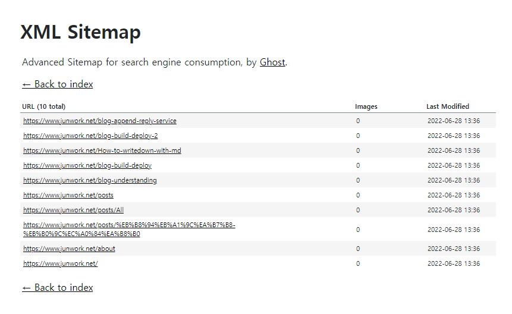
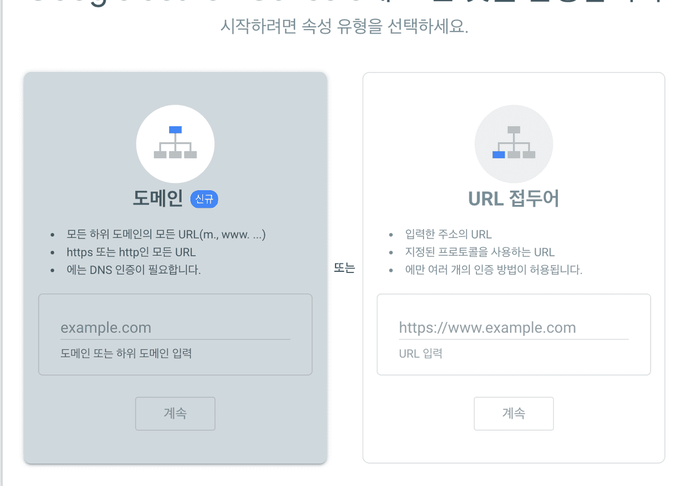
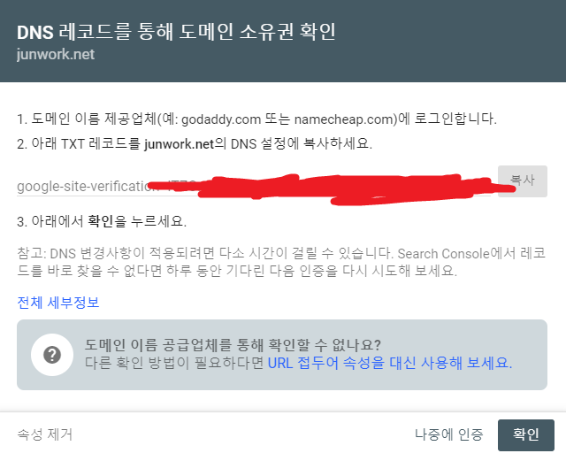
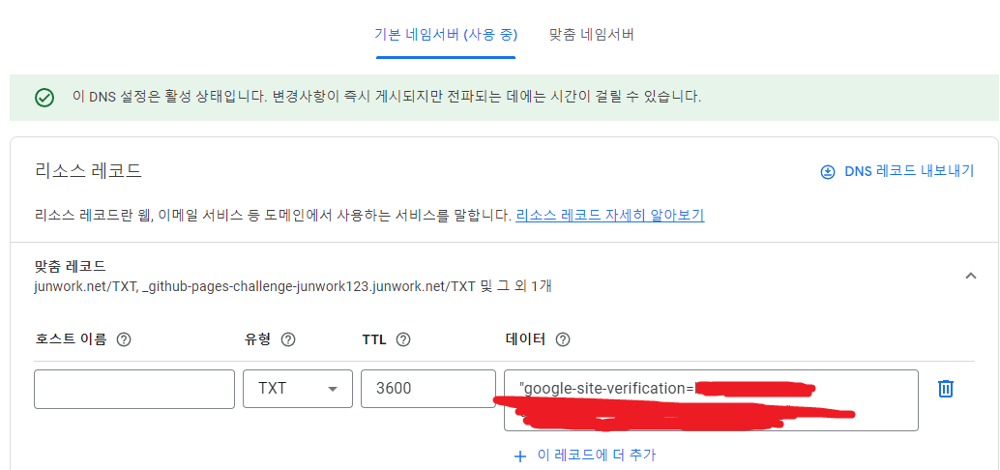
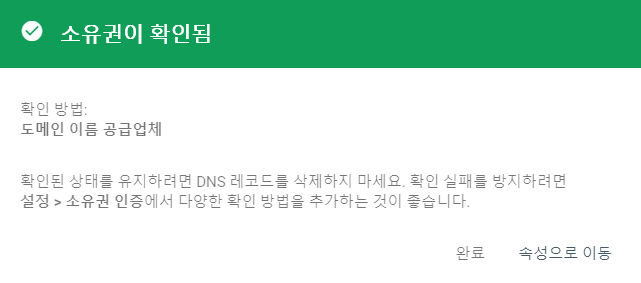
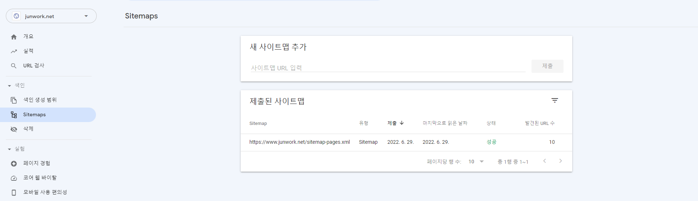

## 구글 서치콘솔(SearchConsole)

구글 서치콘솔은 우리 사이트가

구글에 더 많이 노출될 수 있도록 해주고,

각종 접속 통계를 제공하는 편리한 서비스이다.

구글 서치콘솔을 이용하려면 먼저 사이트맵 파일을 준비해야 한다.

필자의 블로그는 react 기반이므로

지킬(jekyll)이나 티스토리 같은 다른 플랫폼을 이용중이라면

사이트맵만 만들어서 돌아오자([다음 단계](#search-console))

<br/><br/>

## gatsby 사이트맵 패키지 설치

```yml
npm install --save gatsby-plugin-advanced-sitemap
```

위의 패키지 말고도 다른 패키지가 있지만

필자는 gatsby를 사용하고 있기도 하고

인간친화적인 사이트맵 생성이라는 설명에 끌려서 `advanced-sitemap`을 선택했다.

다른 패키지가 써보고 싶다면

`react-route-sitemap`, `gatsby-plugin-sitemap`을 검색해보자

<br/><br/>

## `gatsby-config.js`에 프로젝트 설정에 추가

```yml
siteMetadata: {
siteUrl: `자신의 URL 입력`,
},
plugins: [
`gatsby-plugin-advanced-sitemap`
]
```

<br/><br/>

## 빌드 후 사이트맵 확인

플러그인에 잘 적용했다면 빌드 후

`www.자신의 URL/sitemap-pages.xml`로 접속하면



이와 같은 자신의 사이트맵을 볼 수 있다.

빌드 때마다 업데이트 되므로 매번 확인할 필요없다!

<span id="search-console"/>

<br/><br/>

## 서치콘솔에 등록하기

구글 서치콘솔에 처음 접속하면 아래와 같은 팝업을 만나게 된다.



자신의 사이트가 맞는지 소유주를 확인하는 절차이다.

필자처럼 개인도메인이 있다면 왼쪽,

아니라면 오른쪽을 선택하자. (오른쪽 선택자는 [이 블로그](https://sasumpi123.github.io/general/gitblog4/) 참고)

<br/><br/>

##



왼쪽을 선택하면 DNS에서 확인할 수 있는 `TXT 레코드`를 받을 수 있다.

필자는 Google Domains에서 `TXT 레코드`로 아래와 같이 등록하였다.



다시 서치콘솔로 돌아와서 `확인`버튼을 누르면

기분좋은 향기가 날것같은 초록색과 함께 확인이 완료된다.

<br/><br/>

##



그리고 sitemap메뉴에 들어가서

아까 우리가 만든 사이트맵 주소(자기url/sitemap-pages.xml)을 입력하면

<br/><br/>

##



우리 사이트가 구글에 더 잘 검색될 수 있게된다.

~~내 사이트 처음으로 구글에... 감격~~ :sob:

<br/><br/>

##


```toc

```
