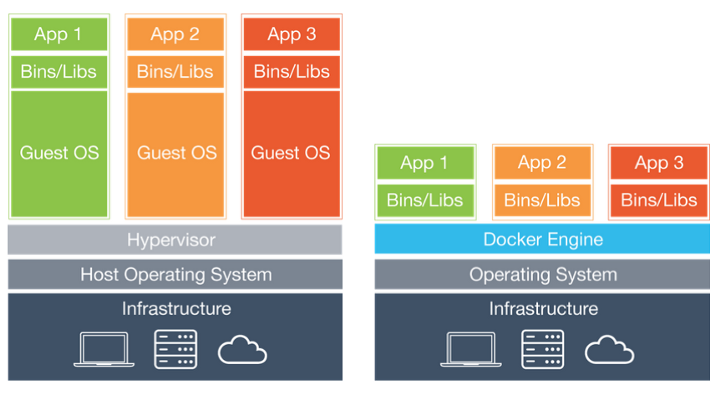
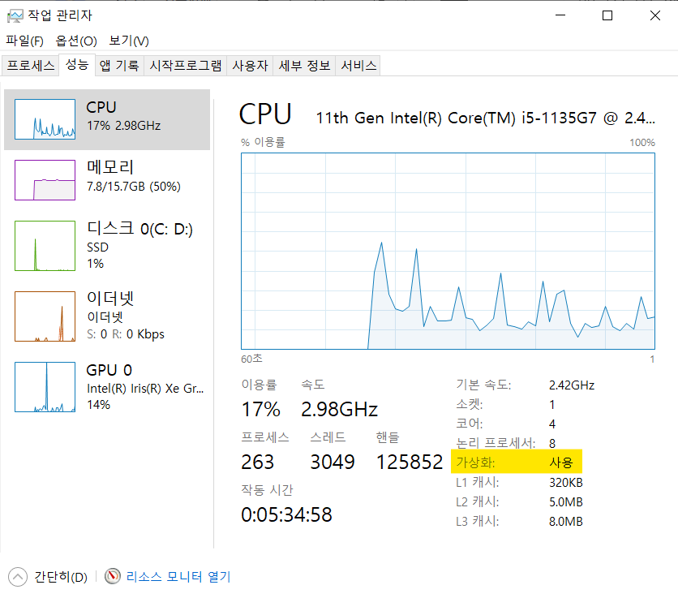
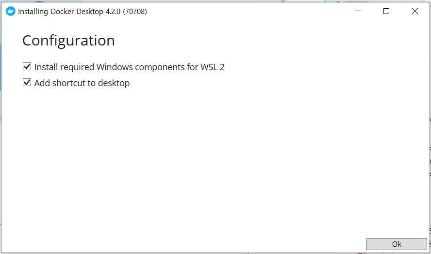
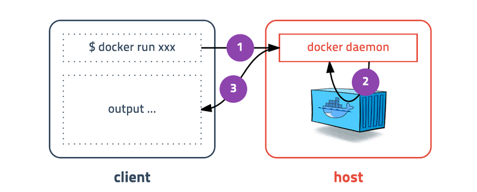

지적과 댓글은 언제나 환영합니다!

<br>

이 글은 4편의 시리즈물로 제작하였다.

- `개념편` : Docker가 뭐길래!?

- `실습편` : 어플리케이션을 Docker로 배포하기

- `심화편` : 변경사항을 Docker로 자동 배포하기

- `번외편` : Docker 공식문서 같이읽기

<br>

<u>**시작해보자!**</u>

<br>

---

# Docker가 뭐길래!?

도커, 도커, 도커, 도커

컴퓨터 업계에 종사하는 이들이라면,

메아리로도 한번쯤은 들어본 적 있는 이름이다.

<br>

도커가 뭔지 몰라도 

아래 장점을 한번만 읽어보도록 하자.

<br>

- 도커는 소프트웨어 전달 주기를 가속한다.

      기업용 소프트웨어는 변화하는 환경에 신속히 대응해야 한다. 수요에 맞춰 스케일링(scaling)을 간단히 할 수 있고, 비즈니스가 요구하는 신기능을 추가하는 업데이트를 간단히 할 수 있어야 한다는 의미다.
      도커 컨테이너는 새 업무 기능을 가진 소프트웨어의 신 버전을 신속히 실무에 투입할 수 있고, 필요 시 이전 버전으로 신속히 롤백할 수 있다.

- 도커는 애플리케이션 이동을 가능하게 한다.

      도커 컨테이너는 애플리케이션이 실행해야 하는 모든 것을 (그리고 오로지 그러한 것들만을) 캡슐화하기 때문에 애플리케이션이 환경들 사이에서 손쉽게 이동할 수 있다. 도커 런타임이 설치된 호스트라면, 그것이 개발자의 노트북이든, 개별 퍼블릭 클라우드든, 도커 컨테이너를 실행할 수 있다.

- 도커는 시스템 자원을 좀더 효율적으로 이용할 수 있다

      컨테이너에 담긴 앱은 가상 머신보다 훨씬 더 적은 메모리를 사용하며, 더 신속하게 시작하고 중지하며, 호스트 하드웨어에서 훨씬 더 밀도 있게 배치될 수 있다. 따라서 그만큼 IT비용이 줄어든다.


<br>

요약하자면, 

도커는 개발환경, 설치환경을 신속하고 쾌적하게 해준다는 이야기로 들린다.

과연, 도커가 뭐길래 이렇게 각광받는걸까?

<br>


---

## **도커(Docker)와 컨테이너(Container)**

<br>

### **도커(Docker)란?**

도커는 리눅스의 응용 프로그램들을 프로세스 격리 기술들을 사용해

<u>컨테이너(Container)</u>로 실행하고 관리하는 오픈소스 프로젝트이다.

<br>

### **<u>컨테이너(Container)</u>란?**

컨테이너는 격리된 공간에서 프로세스가 작동하는 기술이다.

여기에는 <u>코드, 런타임, 시스템 도구, 시스템 라이브러리 등</u> 서버에 설치되는 무엇이든 포함될 수 있다.

이는 <u>**실행 중인 환경에 관계 없이 언제나 동일하게 실행될 것을 보증**</u>한다.

<br>

---

## **기존 VM(Virtual Machine)과 컨테이너는 무슨 차이일까?**

<br>



VM(왼쪽)과 Docker(오른쪽)의 구성도

<br>

우리에게 익숙한 [VMware](http://www.vmware.com/)나 [VirtualBox](https://www.virtualbox.org/)같은 가상머신은

호스트 OS 위에 게스트 OS 전체를 가상화하여 사용하는 방식이다.

이 방식은 무겁고 느려서 운영환경에선 사용하기 어려웠다.

<br>

이를 개선하기 위해 등장한 것이 **컨테이너(Container)** 방식이다.

단순히 프로세스를 격리시키기 때문에

호스트 OS에서 게스트 OS를 오가는 VM방식보다 가볍고 빠르게 동작한다.

(어려운 말로 Context Switching의 Overhead가 적다!)

<br>

하나의 서버에 여러개의 컨테이너를 실행하면

서로 영향을 미치지 않고 독립적으로 실행되어

기존 VM과는 다르게 성능적으로도 거의 손실이 없다.

(물론 네트워크 통신으로 인한 손실은 일부 있다!)

<br>

---

## 도커의 작동방식

<br>


<br>

도커에서 가장 중요한 개념은 컨테이너와 <u>이미지(Image)</u>이다.

<u>이미지(Image)</u>는 **컨테이너 실행에 필요한 파일과 설정값등을 포함하고 있는 일종의 템플릿이다.**

도커 이미지 자체는 시작하거나, 실행할 수 없다.

컨테이너를 생성하면 불변 이미지(immutable image) 위에 쓰기 가능한 레이어가 추가되는 것뿐이다.

즉, 프로그램과 프로세스의 차이처럼 컨테이너는 이미지를 실행한 상태라고 볼 수 있다.

<br>

이미지의 종류는 OS, DB, VCS, 라이브러리, 프레임워크, 언어 등 다양한 종류를 포함할 수 있다.

이렇게 다양한 종류의 이미지를 레이어(Layer)라고 하여, 불변 이미지로써 조합하여 사용할 수 있다.

Ubuntu + PostgreSql + Spring Boot의 조합을 담은 실행환경을 파일 하나로 공유하고 실행을 보증할 수 있다.

<br>

생각해보라.

개발환경에서 설치하고, 환경변수를 세팅하고,

의존성 추가 등 설치에 들어가는 시간과 비용을 줄일 수 있고, 1초만에 복제하고 확장할 수 있다.

몇 기가짜리 파일을 계속 주고 받을 필요도 없다.

<br>

또한, Docker 위에 올라간 어플리케이션을 수정하면, 수정한 읽기/쓰기 레이어만 바꾸면 된다.

Docker는 이미지 레이어를 그대로 사용하면서

컨테이너가 실행중에 생성하는 파일이나 변경된 내용은

읽기/쓰기 레이어에 저장되므로 여러개의 컨테이너를 생성해도 최소한의 용량만 사용한다.

<br>

---

## 간단한 도커 설치

<br>

도커 설치는 간단한 편이므로 운영체제에 맞게 짧고 빠르게 넘어가도록 하자.

<br>

### **윈도우**



<br>

방법1. Hyper-V를 이용하는 방법(간단)

1. **작업관리자 > 성능**에서 가상화가 **'사용'**으로 되어있는지 확인한다.

2. **Window + S**를 눌러 **'Windows 기능'**을 검색 → **Hyper-V**를 체크하고 **확인**을 눌러 설치 → 재부팅

<br>

방법2. WSL2를 이용하는 방법

1. **Windows 기능 켜기/끄기**에서 **Linux용 Windows 하위 시스템, 가상머신 플랫폼**을 체크한다.

2. **Linux 커널 업데이트 패키지 [다운로드](https://wslstorestorage.blob.core.windows.net/wslblob/wsl_update_x64.msi) 및 실행**

3. **PowerShell에서 WSL 기본 버전을 2로 세팅한다.**

   ```powershell
   wsl --set-default-version 2
   ```

<br>

방법1 or 2를 완료했다면 아래 링크에서 도커 설치파일을 다운로드 받고 실행하자

[Install Docker Desktop on Windows | Docker Documentation](https://docs.docker.com/desktop/install/windows-install/)



**중간에 나오는 WSL2 관련 옵션도 체크해주자**

<br>

설치가 완료되면 **Close and log out**을 누르고 다시 윈도우에 로그인하고 약관에 동의하면 완료!

<br>

### **리눅스**

리눅스의 설치는 아래 명령어를 통해 간단히 설치할 수 있다!

```bash
curl -fsSL https://get.docker.com/ | sudo sh
```

<br>

## 설치 확인하기

설치가 완료되었다면, 아래 명령어로 한번 확인해보자!

<br>

```bash
docker version
```

<br>

      Client:
      Version:      1.12.6
      API version:  1.24
      Go version:   go1.6.4
      Git commit:   78d1802
      Built:        Wed Jan 11 00:23:16 2017
      OS/Arch:      darwin/amd64

      Server:
      Version:      1.12.6
      API version:  1.24
      Go version:   go1.6.4
      Git commit:   78d1802
      Built:        Wed Jan 11 00:23:16 2017
      OS/Arch:      linux/amd64

`Client`와 `Server` 정보가 출력되었다면, 정상이다!.

<details>
    <summary>혹시 에러가 발생한 경우</summary>

   
   > Error response from daemon: Bad response from Docker engine

   Server 정보가 안나오고 위 메시지가 나왔다면

   docker daemon이 정상적으로 실행되지 않았거나 
   
   sudo를 입력하지 않은 경우 발생할 수 있다.

</details>

<br><br>

왜 버전 정보에 클라이언트와 서버로 나뉘어 등장할까?

<br>



<br>

도커는 특이하게도 하나의 실행파일이지만 

위와 같은 구조로 클라이언트와 서버로 나뉘어서 동작한다.

<br>

우리가 입력하는 명령어는 

클라이언트에서 입력받지만 서버로 전송된다.

<br>

다시 이 정보가 서버에서 클라이언트로 보내지기 때문에

마치 하나처럼 느껴지는 것이다.

<br>

다음편에서는 IntelliJ에서 SpringBoot를 Docker 이미지로 배포해보도록 하자.

<br>

---

<br>

_출처_

_[[Docker] 도커 시작하기 - 1. 도커 설치하기 (tistory.com)](https://da2uns2.tistory.com/entry/Docker-%EB%8F%84%EC%BB%A4-%EC%8B%9C%EC%9E%91%ED%95%98%EA%B8%B0-1-%EB%8F%84%EC%BB%A4-%EC%84%A4%EC%B9%98%ED%95%98%EA%B8%B0)_

_[[Kubernetes] 쿠버네티스 윈도우에 설치하기 (Docker Desktop) (tistory.com)](https://onu0624.tistory.com/102)_

_[초보를 위한 도커 안내서 - 도커란 무엇인가? (subicura.com)](https://subicura.com/2017/01/19/docker-guide-for-beginners-1.html)_

<br/>

---

```toc

```
