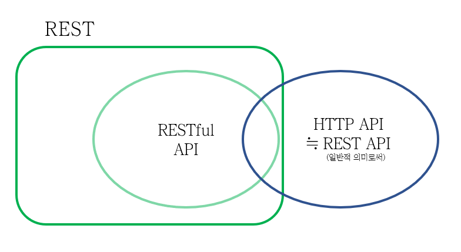

지적과 댓글은 언제나 환영합니다!

<br>

## 개요

공학자로써 단어의 정의는 굉장히 중요하다.

오늘은 논쟁이 굉장히 많은 주제이자, 헷갈리기 쉬운 주제인

REST와 REST API, RESTful API에 대해 알아보도록 하자.

<br>

---

## 범위

정의를 살펴보기에 앞서 범위를 살펴보고 가자.

~~직접 그린 그림이다~~



위 그림을 기준으로 살펴보면 

REST는 어떠한 개념이고, RESTful API는 완전히 REST에 속한 것으로 보인다.

반면, REST API는 REST, RESTful API와 일부 섞일수도 있어보인다.

<br/>

---

## 정의

그렇다면 각각 어떤 정의길래 위와 같은 그림이 나오는 것일까?

요약하면 다음과 같다.

`REST` : 분산 하이퍼미디어 시스템을 위한 아키텍쳐 요소를 추상화 한 것.

`RESTful API` : REST 개념을 잘 지킨 API.

`HTTP API` ($\fallingdotseq$ REST API) : REST 개념을 기반으로 한 API. (REST 개념을 일부만 따른다.)
    

<br/>

여기서 `REST API`에 대한 논쟁이 발생하는데

REST의 정의가 추상적이라서 잘 이해가 가지 않을 것이다.

좀 더 자세히 들여다보자.

<br/>

---

## REST(Representational State Transfer)

REST 개념을 창시한 로이 필딩(Roy Fielding)은 

REST를 다음과 같이 정의했다.


> REST(Representational State Transfer)란 
>
> `분산 하이퍼미디어 시스템(=웹)`을 위한 
>
>`아키텍쳐 요소를 추상화 한 것`이다.

<details>
    <summary>(원문참조) Representational State Transfer (REST) style</summary>
    
> The Representational State Transfer (REST) style is an abstraction of the architectural elements within a distributed hypermedia system.
> <div style="text-align: right">- Architectural Styles and the Design of Network-based Software Architectures (Roy Thomas Fielding, 2000)<div>

</details>
<details>
    <summary>(용어심화) 분산 하이퍼미디어 시스템</summary>

- 이 논문에서는 대표적으로 Web을 의미한다.

- 원문(정확한 정의를 찾기 어려워서 논문에서 사용된 문장으로 갈음했다.)_

> Distributed hypermedia provides a uniform means of accessing services through the embedding of action controls within the presentation of information retrieved from remote sites.
>  <div style="text-align: right">- Architectural Styles and the Design of Network-based Software Architectures (Roy Thomas Fielding, 2000)<div>

<br>

- 해석하자면 다음과 같다. 

> 분산 하이퍼미디어는 원격 사이트에서 검색된 정보 표시 내에 작업 제어를 포함하여 서비스에 액세스하는 균일한 수단을 제공한다.

</details>

<details>
    <summary>(용어심화) 아키텍쳐 요소 추상화</summary>

- 이 논문에서 `아키텍쳐 스타일`과 같은 의미로 사용되었다.

- 원문은 아래와 같다

> An architectural style is a coordinated set of architectural constraints that restricts the roles/features of architectural elements and the allowed relationships among those elements within any architecture that conforms to that style.
>  <div style="text-align: right">- Architectural Styles and the Design of Network-based Software Architectures (Roy Thomas Fielding, 2000)<div>

- 해석하자면 다음과 같다.

> 아키텍처 스타일은 아키텍처 제약 조건의 조정된 집합이다. 아키텍처 요소의 역할/기능을 제한하고 허용되는 모든 아키텍처 내에서 해당 요소 간의 관계는 해당 스타일을 따른다.
</details>

<br/>

즉, REST는 아키텍쳐 스타일(제약조건)이자, 아키텍쳐 스타일의 집합인 것이다.

REST를 구성하는 스타일은 6가지가 있다.

이를 모두 지켜야만 REST라고 논문저자는 강조하고 있다.

<br/>

---

## REST의 스타일 6가지

<br>

1. `Client-Server` 구조 : 자원 요청자 <-> 제공자의 역할 분담.

2. `Stateless` : 무상태성, 상태저장 X

3. `Cache` : 네트워크 효율성을 위한 캐시 응답 가능.

4. [Uniform interface](#Uniform)

5. `Layered System` : 프록시 서버, 로드 밸런싱 등 다중계층 사용가능.

6. `Code-on-demand`(Optional) : 서버에서 보낸 코드를 클라이언트에서 스크립트 형태로 실행가능.
<br/>

HTTP 스펙을 따른다면 

`4. Uniform interface` 항목을 제외하고 대부분 지켜진다.

<br/>

이 스타일에 따라, 

API 중에서 <u>6가지를 모두 만족하면 RESTful API,</u>

<u>일부만 만족하면 REST API</u>라고 이야기할 수 있다.

`논문의 저자는 이마저도 REST API가 아니라고 주장하므로 유의가 필요하다.`

<br/>

---

## Uniform interface <span id="Uniform"></span>

<br>

이 항목은 4개의 제약조건으로 구성되어 있다.


1. Identification of resources
    
    = 리소스가 URI로 식별 가능해야 한다.

2. Manipulation of resources through representations

    = 리소스를 representation 전송으로 조작해야 한다.

3. `Self-descriptive messages`
    
    = 자기서술적인 메시지를 가져야 한다.

        요청(Request)과 응답(Response) 메시지의 각 항목이
        어떤 의미인지까지 모두 알수있도록 
        명세나 문서가 있어야 OK.
        
        ex) message content가 JSON이면, JSON의 각 항목의 의미를 모두 적어야 한다.
    ```JSON
    {
        HTTP/1.1 200 OK
        Content-Type: application/json
        Link: <https://명세문서주소>; rel="profile"
        {"id":1, "name":"john doe"}
    }
    ```

4. `HATEOAS`(Hypermedia as the engine of application state)

    = 하이퍼링크를 통해 어플리케이션의 상태 전이가 가능해야 한다.

        응답(Response) 메시지에 
        다음 상태로 이동가능한 Hypermedia(링크)가 있어야 한다.

    ```JSON
    {
        "data": {
            "id": 1000,
            "self": "http://localhost:8080/api/article/1000", // 현재 api 주소
            "next": "http://localhost:8080/api/article/1001", // 다음 article을 조회하는 URI
            "comment": "http://localhost:8080/api/article/comment", // article의 댓글 달기
        },
    }
    ```


<br/>

---

## 이렇게까지 구현해야하는가? 

<br>

논문 저자 Roy Fielding은 

꾸준히 REST에 대한 논의를 펼치면서

다음과 같은 내용을 남겼다.

> 시스템을 통제할 수 있다고 생각한다면
>
> REST에 시간을 낭비하지 말라!

<br>

또한, 논문에도 같은 의미의 내용을 확인할 수 있다.

> Uniform Interface 제약조건은 비효율적이다.
> 
> 이 방식은 표준화된 방식을 강요하기 때문에
>
> 상황에 따라 최적이 아닐 수 있다.

<br>

---

## 마무리

<br>

이번 포스팅에서는 

REST의 개념과 범위에 대해서 알아보았다.

REST가 꼭 필요한 경우라면 RESTful하게 구현해야겠지만

그렇지 않은 경우 REST를 일부 준수하는 HTTP API로 구현하도록 하자.

\+ 용어 사용에 신중을 기해서 사용하도록 하자!


---

_출처_

_[Architectural Styles and the Design of Network-based Software Architectures (Roy Thomas Fielding, 2000)](https://www.ics.uci.edu/~fielding/pubs/dissertation/fielding_dissertation.pdf)_

_[그런 REST API로 괜찮은가 (이응준님, DEV 2017 발표)](https://www.youtube.com/watch?v=RP_f5dMoHFc&list=WL&index=36)_

_[REST API가 뭔가요? (얄팍한 코딩사전님)](https://www.youtube.com/watch?v=iOueE9AXDQQ&list=WL&index=37)_

_[[10분 테코톡] 정의 REST API (정 님, 우아한테크코스 백엔드 4기)](https://www.youtube.com/watch?v=Nxi8Ur89Akw&list=WL&index=64)_

<br/>

---

```toc

```
