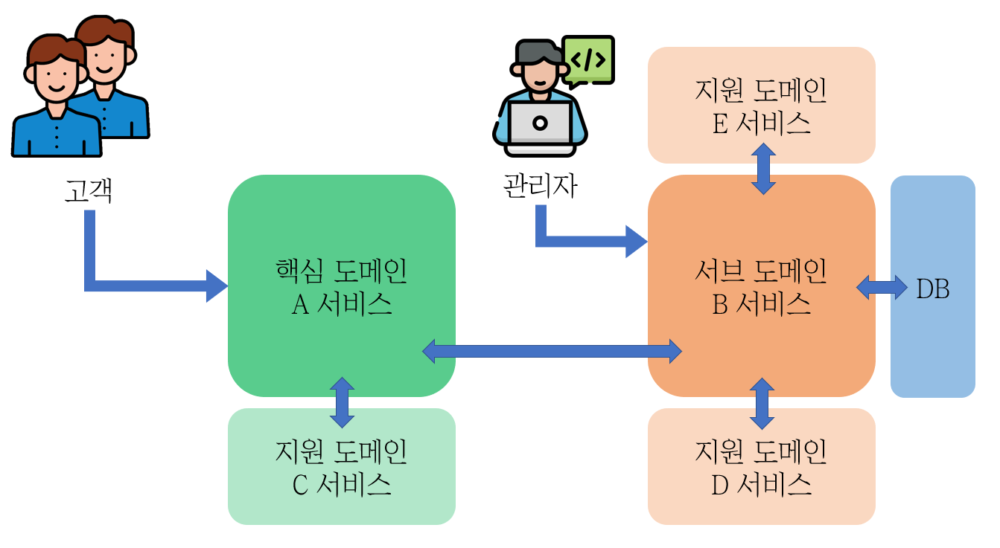

지적과 댓글은 언제나 환영합니다!

<br>

---

<br>

# 도커 삽질 개선하기

<br>

## 이전편 요약

이전 편 `[도커 삽질하기](https://www.junwork.net/dockerize-msa-basic/)` 에서는 단순 리눅스 컨테이너를 생성해서

직접 명령어를 타이핑하면서, 컨테이너의 상태를 변경하였다.

<br>

그 결과, 컨테이너가 재부팅되면 대부분의 데이터와 상태가 소실되어

같은 과정을 반복해야 했다.

<br>

---

<br>

## 목표

도커 컨테이너 설정을 간소화, 자동화해보자



- 공통 설정 분리 → env 파일 생성

- DB에 대한 dockerfile 작성 → 이미지 생성

- Package(서브도메인B, 지원도메인D)에 대한 dockerfile 작성 → 이미지 생성

- docker-compose를 이용해서 실행

<br>

---

## 여정

1. env 파일로 설정 분리
    
    ```docker
    # DB Configuration
    TZ=Asia/Seoul
    DB_HOST=0.0.0.0 # 외부 DB와 연결하고 싶을 때 DB IP 입력
    DB_KIND=postgresql # oracle, tibero
    DB_NAME=db
    DB_SCHEMA_NAME=schema
    DB_USER=postgres
    DB_PASSWORD=0000
    DB_PORT_IN=5432
    DB_PORT_OUT=5432
    
    # SERVICE_B Configuration
    SERVICE_B_IP=0.0.0.0 # 관리도구를 실행할 호스트의 IP로 변경
    SERVICE_B_NAME=SERVICE_B
    SERVICE_B_PORT_IN=8080
    SERVICE_B_PORT_OUT=8080
    
    # SERVICE_D Configuration
    SERVICE_D_NAME=kit1
    SERVICE_D_PORT_IN=8888
    SERVICE_D_PORT_OUT=8888
    SERVICE_D_CACHE_PORT_IN=8900
    SERVICE_D_CACHE_PORT_OUT=8900
    ```
    
2. SERVICE_B에 대한 dockerfile 작성
    
    ```yaml
    # database.properties 설정파일 예시
    
    schema.name=${DB_SCHEMA_NAME}
    spring.datasource.username=${DB_USER}
    spring.datasource.password=${DB_PASSWORD}
    
    # Postgresql
    spring.datasource.url=jdbc:postgresql://${DB_HOST}:${DB_PORT}/${DB_NAME}?useUnicode=true&characterEncoding=utf8&currentSchema=${DB_SCHEMA_NAME}
    spring.datasource.driver-class-name=org.postgresql.Driver
    spring.jpa.hibernate.dialect=org.hibernate.dialect.PostgreSQL10Dialect
    ```
    
    ```docker
    # APPLICATION
    FROM openjdk:8-jdk-alpine
    
    ENV APPNAME SERVICE_B
    ENV WORKDIR /home/$APPNAME
    WORKDIR $WORKDIR
    COPY ./target/lib $WORKDIR/lib
    COPY ./conf $WORKDIR/conf
    COPY  ./target/SERVICE_B-7.1.0.jar $WORKDIR/lib/SERVICE_B-7.1.0.jar
    
    ENTRYPOINT [ "java", ... ]
    ```
    
3. SERVICE_D에 대한 dockerfile 작성
    
    ```docker
    # SERVICE_D
    FROM openjdk:8-jdk-alpine
    
    ENV APPNAME SERVICE_D
    ENV WORKDIR /home/$APPNAME
    WORKDIR $WORKDIR
    
    COPY ark  $WORKDIR/ark
    COPY conf $WORKDIR/conf
    COPY ./target/SERVICE_D-7.1.0.jar $WORKDIR/app.jar
    
    ENTRYPOINT ["java", "-jar", "app.jar","$NODENAME", "start" ]
    ```
    
4. DB에 대한 dockerfile 작성 및 이미지 빌드
    - 컨테이너 내부 DB 이용하는 경우(Docker_db 파일)
        
        ```docker
        # Database
        FROM postgres:14
        
        ENV APPNAME DBInstaller
        ENV WORKDIR /home/$APPNAME
        WORKDIR $WORKDIR
        COPY conf $WORKDIR/conf
        
        # 타임존 설정
        RUN ln -snf /usr/share/zoneinfo/$TZ /etc/localtime \
            && echo $TZ > /etc/timezone
        
        # update 및 패키지 설치
        RUN apt update \
            && apt install -y sudo procps # openjdk-11-jdk vim git tar gzip build-essential curl alien
        
        RUN chmod 777 $WORKDIR/conf/init.sh $WORKDIR/conf/postgresql_table.sql
        
        # sed -i "s/{SERVICE_B_SCHEMA_NAME}/$DB_SCHEMA_NAME/g" "$WORKDIR"/conf/postgresql_table.sql
         #ENTRYPOINT su postgres $WORKDIR/conf/init.sh
        ```
        
        ```bash
        #!/bin/bash
        
        # Create a user and a database
        psql -U "$DB_USER" -c "CREATE DATABASE $DB_NAME;"
        
        psql -U "$DB_USER" -d "$DB_NAME" -c "CREATE SCHEMA $DB_SCHEMA_NAME;"
        
        # Run the SQL script to initialize the database
        psql -U "$DB_USER" -d "$DB_NAME" -a -f "$WORKDIR"/conf/postgresql_table.sql
        ```
        
        ```yaml
        docker build -f Dockerfile_db -t pg14:7.1.0 .
        ```
        
    - 외부 DB를 연결하는 경우
        
        → Dockerfile 작성 X
        
        → 설정파일에서 `DATABASE_HOST`  주석을 풀고 다음 단계로 진행
        
5. docker-compose 작성
    - 컨테이너 내부 DB 이용하는 경우(docker-compose.yml)
        
        ```bash
        services:
            database:
                image: mypg:7.1.0
                container_name: db_instance
                restart: unless-stopped
                ports:
                  - ${DB_PORT_IN}:${DB_PORT_OUT}
                volumes:
                  - db_storage:/var/lib/postgresql/data
                environment:
                  DB_KIND: ${DB_KIND}
                  DB_NAME: ${DB_NAME}
                  DB_SCHEMA_NAME: ${DB_SCHEMA_NAME}
                  DB_USER: ${DB_USER}
                  POSTGRES_PASSWORD: ${DB_PASSWORD}
                  TZ: ${TZ}
                healthcheck:
                  test: ["CMD", "pg_isready", "-U", "postgres"]
                  interval: 10s
                  timeout: 3s
                  retries: 3
        
            SERVICE_B:
                build:
                  context: .
                  dockerfile: Dockerfile
                image: SERVICE_B:7.1.0
                container_name: SERVICE_B
                restart: always
                depends_on:
                  database:
                    condition: service_healthy
                ports:
                  - ${SERVICE_B_PORT_IN}:${SERVICE_B_PORT_OUT}
                environment:
                  NODENAME: ${SERVICE_B_NAME}
                  DB_HOST: db_instance
                  DB_KIND: ${DB_KIND}
                  DB_NAME: ${DB_NAME}
                  DB_SCHEMA_NAME: ${DB_SCHEMA_NAME}
                  DB_USER: ${DB_USER}
                  DB_PASSWORD: ${DB_PASSWORD}
                  DB_PORT: ${DB_PORT_OUT}
        
            SERVICE_D:
                image: SERVICE_D:7.1.0
                container_name: SERVICE_D
                restart: always
                depends_on:
                  database:
                      condition: service_healthy
                ports:
                  - ${SERVICE_D_PORT_IN}:${SERVICE_D_PORT_OUT}
                  - ${SERVICE_D_CACHE_PORT_IN}:${SERVICE_D_CACHE_PORT_OUT}
                environment:
                  NODENAME: ${SERVICE_D_NAME}
                  DB_HOST: db_instance
                  DB_KIND: ${DB_KIND}
                  DB_NAME: ${DB_NAME}
                  DB_SCHEMA_NAME: ${DB_SCHEMA_NAME}
                  DB_USER: ${DB_USER}
                  DB_PASSWORD: ${DB_PASSWORD}
                  DB_PORT: ${DB_PORT_OUT}
                  SERVICE_B_IP: ${SERVICE_B_IP}
        volumes:
          db_storage:
            driver: local
        ```
        
        ```docker
        # .env 파일은 그냥 실행해도 인식함
        # --force-recreate : 컨테이너를 삭제 후 재생성
        # docker compose up -d --force-recreate
        
        # .env 파일을 여러개 만들면 아래와 같이 실행
        docker-compose --env-file .\.env.local up -d
        
        # DB 컨테이너에서 스크립트 실행
        docker exec -it db_instance /bin/bash
        sed -i "s/{SERVICE_B_SCHEMA_NAME}/$DB_SCHEMA_NAME/g" "$WORKDIR"/conf/postgresql_table.sql
        su postgres $WORKDIR/conf/init.sh
        
        # 종료
        docker compose down -v
        ```
        
    - 외부 DB를 연결하는 경우(docker-compose-external-db.yml)
        
        ```docker
        services:
          SERVICE_B:
            build:
              context: .
              dockerfile: Dockerfile
            image: SERVICE_B:7.1.0
            container_name: SERVICE_B
            restart: always
            ports:
              - ${SERVICE_B_PORT_IN}:${SERVICE_B_PORT_OUT}
            environment:
              NODENAME: ${SERVICE_B_NAME}
              DB_HOST: ${DB_HOST}
              DB_KIND: ${DB_KIND}
              DB_NAME: ${DB_NAME}
              DB_SCHEMA_NAME: ${DB_SCHEMA_NAME}
              DB_USER: ${DB_USER}
              DB_PASSWORD: ${DB_PASSWORD}
              DB_PORT: ${DB_PORT_OUT}
        
          SERVICE_D:
            image: SERVICE_D:7.1.0
            container_name: SERVICE_D
            restart: always
            ports:
              - ${SERVICE_D_PORT_IN}:${SERVICE_D_PORT_OUT}
              - ${SERVICE_D_CACHE_PORT_IN}:${SERVICE_D_CACHE_PORT_OUT}
            environment:
              NODENAME: ${SERVICE_D_NAME}
              DB_HOST: ${DB_HOST}
              DB_KIND: ${DB_KIND}
              DB_NAME: ${DB_NAME}
              DB_SCHEMA_NAME: ${DB_SCHEMA_NAME}
              DB_USER: ${DB_USER}
              DB_PASSWORD: ${DB_PASSWORD}
              DB_PORT: ${DB_PORT_OUT}
              SERVICE_B_IP: ${SERVICE_B_IP}
        ```
        
        ```docker
        # 19번 설정파일을 외부 DB에 연결하는 compose 명령어
        docker compose --env-file .\.env.19 -f .\docker-compose-external-db.yml up -d
        ```
        
6. 종료하기
    
    ```yaml
    # 종료 및 볼륨 삭제
    docker compose down -v
    ```
    

## Q & A


<details>
    <summary>DB 컨테이너에서 다음과 같은 에러가 발생합니다 
    psql: error: connection to server on socket "/var/run/postgresql/.s.PGSQL.5432" failed: No such file or directory</summary>

    이 에러가 발생한 경우에는 PostgreSQL 서버가 실행되고 있지 않거나 서버에 접속할 수 있는 소켓 파일이 없기 때문일 수 있다.
    
    해결 방법으로는 다음과 같은 것들을 시도해 볼 수 있다:
    
    1. PostgreSQL 서버가 실행 중인지 확인하고, 실행 중이 아니라면 서버를 시작한다.
        
      ps aux | grep postgres
        
    2. 소켓 파일이 없기 때문에 접속이 실패한 것일 수도 있으므로, 소켓 파일을 생성해준다.
    
     소켓 파일을 생성하려면 **`pg_ctl`** 명령어를 사용할 수 있다. 
     
     예를 들어, 아래와 같이 입력할 수 있다:
        
      su postgres
      
      pg_ctl -w restart
    

</details>

<br>

<details>
    <summary>볼륨을 여러곳에서 같이 쓰고 싶어요</summary>

    volumes을 공유해서 사용할시 주의할 점은 공유할 볼륨의 이름을 컨테이너에 명시하는 것 뿐만 아니라 경로도 같아야 한다는 점이다.
    
    nodejs 컨테이너의 볼륨의 경로가 만약 아래처럼 변경된다면
    
    - shared-data:/test/nodejs
    
    db 컨테이너의 볼륨의 경로도 아래처럼 바꿔줘야지만 같은 볼륨을 두 컨테이너에서 동시에 사용할 수 있다.

    - shared-data:/test/mysql
    
</details>

<br>

<details>
    <summary>현재 상태를 이미지로 저장하고 싶어요</summary>

    # 호스트 OS에서
    docker commit -m "메시지" 컨테이너명 이미지명:태그

</details>

<br>

<details>
    <summary>docker-compose vs docker compose, 무슨 차이인가요?</summary>

    docker-compose : 구버전, python 기반
    
    docker compose : 신버전, Go언어 기반 + 신규 명령어 추가
    
    (실행 속도는 비슷하다.)

</details>
    
<br>

<details>
    <summary>jar 파일 실행 시, Main Class를 찾을 수 없다는 에러가 발생합니다</summary>

    [참조글](https://chaelin1211.github.io/study/2021/03/12/springboot-error-01.html)
    
    - Spring boot를 사용하는 경우
        
      pom.xml에 아래 플러그인 추가
        
      <plugin>
          <groupId>org.springframework.boot</groupId>
          <artifactId>spring-boot-maven-plugin</artifactId>
      </plugin>
        
        
    - 순수 Java를 사용하는 경우
        
      jar 대신 war로 패키징하여 실행

</details>
    
<br>

<details>
    <summary>특정 파일의 텍스트를 찾아 바꾸기 하고 싶어요</summary>

    # file.txt 파일에서 "찾을내용"을 "바꿀내용"으로 찾아바꾸기
    
    $ sed -i 's/찾을내용/바꿀내용/g' file.txt
    
    자세한 명령어의 설명은 아래와 같다.
    
    -i : 파일의 내용을 바꿈
    's' : 찾아바꾸기
    'g' : 모든 문자열 바꾸기

</details>

<br>

<details>
    <summary>도커 컨테이너의 캐시를 삭제하고 싶어요</summary>

    docker system prune --volumes

</details>

<br>

<details>
    <summary>환경변수 값이 선택되는 우선순위는 뭔가요?(Compose / Dockerfile / Shell / Env)</summary>

    1. Compose 파일에 직접 입력한 값
    2. 쉘 환경변수로 등록한 값
    3. 환경변수 파일로 입력된 값(`.env` 등)
    4. Dockerfile을 통해 삽입된 값

    ### **우선순위 결정 예시**

    우선, Dockerfile로 아래와 같이 `seongjin_mysql`이라는 이미지를 빌드했다고 가정하자.
    FROM mysql:8
    ENV MYSQL_ROOT_PASSWORD passwd_from_dockerfile


    그리고 쉘 환경에서 아래와 같이 환경변수를 직접 입력한다.
    $ export MYSQL_ROOT_PASSWORD=passwd_from_shell


    다음으로는 `.env` 파일을 만들어 아래와 같이 환경변수를 설정했다고 치자.
    MYSQL_ROOT_PASSWORD=passwd_from_envfile


    마지막으로 배포용 `YAML`은 아래와 같이 작성했다고 가정한다.
    version: '3.9'
    services:
      mysql:
        image: seongjin_mysql
        restart: unless-stopped
        environment:
          MYSQL_ROOT_PASSWORD: passwd_from_yaml


    이러한 환경에서 `docker compose up`을 실행했을 때, 해당 서비스(컨테이너)에 적용된 환경변수 `MYSQL_ROOT_PASSWORD`의 최종값을 상황 별로 알아보면 다음과 같다.

    - 위의 상태 그대로 진행했다면, `MYSQL_ROOT_PASSWORD`의 최종값은 `YAML`에 직접 삽입된 `passwd_from_yaml`이 된다.

    - 만약 `YAML`의 환경변수 항목이 `MYSQL_ROOT_PASSWORD: ${MYSQL_ROOT_PASSWORD}`로 대체된다면, `MYSQL_ROOT_PASSWORD`의 최종값은 쉘에서 커맨드라인으로 입력된 `passwd_from_shell`이 된다.

    - 만약 `YAML`의 환경변수 항목이 `MYSQL_ROOT_PASSWORD: ${MYSQL_ROOT_PASSWORD}`로 대체되고 쉘 환경에서의 환경변수 입력 과정이 생략된다면, `MYSQL_ROOT_PASSWORD`의 최종값은 `.env` 파일에 삽입된 `passwd_from_envfile`이 된다.

    - 만약 `YAML`에서 환경변수 항목이 완전히 삭제되고, 쉘 환경에서의 환경변수 입력 과정이 생략되며, `.env` 파일도 따로 만들어지지 않았다면, `MYSQL_ROOT_PASSWORD`의 최종값은 Dockerfile을 통해 삽입된 `passwd_from_dockerfile`이 된다.

</details>

<br>

---

<br>

## 마치며..

이번 시간에는 컨테이너를 통해 실행환경 설정을 자동화해보았다.

다음 시간에는 원격 저장소 release 브랜치에 push가 발생하면,

docker 이미지로 CI/CD할 수 있도록 해보자

---

<br>

_참고자료_

_[Overview of docker compose CLI | Docker Documentation](https://docs.docker.com/compose/reference/)_

_[[Docker-Basic (10)] Docker File 사용하기 - 실습2 MARIA DB (tistory.com)](https://1mini2.tistory.com/31)_

_[Dockerfile에서 자주 쓰이는 명령어 | Engineering Blog by Dale Seo](https://www.daleseo.com/dockerfile/)_

_[최고의 Dockerfile 작성을 위한 몇 가지 습관들 (velog.io)](https://velog.io/@seheon99/%EC%B5%9C%EA%B3%A0%EC%9D%98-Dockerfile-%EC%9E%91%EC%84%B1%EC%9D%84-%EC%9C%84%ED%95%9C-%EB%AA%87-%EA%B0%80%EC%A7%80-%EC%8A%B5%EA%B4%80%EB%93%A4)_

_[[Dockerfile] Dockerfile이란? Dockerfile 옵션 — 시간이 멈추는 장소 (tistory.com)](https://narup.tistory.com/204)_

_[Dockerfile 작성방법 및 읽는 법 · MinhoPark (mino-park7.github.io)](https://mino-park7.github.io/docker/2018/12/10/dockerfile/)_

_[Docker Compose에서 각 서비스 컨테이너에 쓰이는 환경변수를 다루는 방법 (seongjin.me)](https://seongjin.me/environment-variables-in-docker-compose/)_


```toc

```
