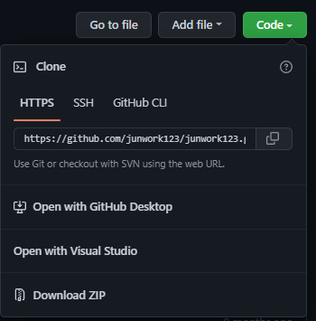

## **사전준비**

아래 코드를 터미널에서 실행시켜서 플러그인을 설치하자.

```
npm install

npm install gatsby

npm install gh-pages --save-dev

npm install copyfiles
```
각각 설치하는 내용은 아래와 같다.

- gatsby : 리액트(React) 기반의 정적 사이트 생성 프레임워크

- gh-pages : GitHub Repository를 이용해 웹 사이트를 무료로 호스팅해주는 서비스

- copyfiles : npm에서 파일 복사를 도와주는 패키지 (개인 도메인이 있는 경우)

<br/>

---


## **package.json에 대한 이해**

다음은 package.json에서 빌드 시 설정할 부분이다.

```json
  "repository": {
    "type": "git",
    "url": "https://github.com/junwork123/junwork123.github.io.git"
  },
  "scripts": {
    "serve": "gatsby serve",
    "build": "gatsby clean && gatsby build",
    "copy" : "copyfiles CNAME public/ && echo 'CNAME file copied.'",
    "start": "gatsby clean && gatsby build && gatsby serve",
    "deploy": "gatsby clean && gatsby build && npm run copy && gh-pages -d public -b gh-pages",
    "test": "echo \"Write tests! -> https://gatsby.dev/unit-testing\" && exit 1"
  },  
```

## `repository`

배포될 원격 저장소의 주소를 나타낸다.

github repository 메인페이지에서 쉽게 복사할 수 있다.

SSH를 사용할 경우 암호키-공개키를 활용하여 Push해야한다.(번거로움)




## `scripts`

`npm run OOO`으로 동작하는 명령어들이다.

`&&`로 명령어를 여러개 연결할 수 있으며 

같은 명령어이기만 하면 `pre`를 붙여서 먼저 실행하도록 하게 할 수 있다.  

<br/>

`deploy`명령어의 마지막에 주목해보자.

    gh-pages -d public -b gh-pages

-d --dir : basePath(빌드 결과물, 배포될 파일들 위치)

-b --branch : options.branch(배포될 브랜치, 여기서는 브랜치명이 `gh-pages`)

-s --src : options.src(배포될 파일들의 매칭패턴, 기본은 `**/*`로 전체 파일이다.)

더 자세한 설명은 [공식 메뉴얼](https://www.npmjs.com/package/gh-pages-cli)에서 확인할 수 있다.

<br/>


---
*배포 자동화 과정 및 개인 도메인 설정은 [다음 2편]()에 계속..*


```toc

```