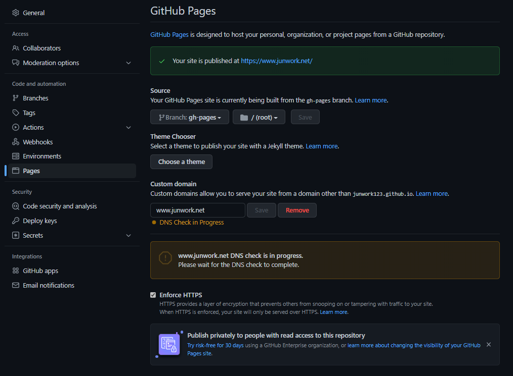

## **사전준비**

아래 코드를 터미널에서 실행시켜서 플러그인을 설치하자.

```
npm install

npm install gatsby@^4.9.3

npm install gh-pages --save-dev

npm install copyfiles
```
각각 설치하는 내용은 아래와 같다.

P.S 이 스킨은 4.9.3버전까지만 동작하는듯 하다. (버전을 잘 확인하자)

- gatsby : 리액트(React) 기반의 정적 사이트 생성 프레임워크 

- gh-pages : GitHub Repository를 이용해 웹 사이트를 무료로 호스팅해주는 서비스

- copyfiles : npm에서 파일 복사를 도와주는 패키지 (개인 도메인이 있는 경우)

<br/>

---

## **개인 도메인 설정**

필자처럼 개인 도메인(ooo.com, xxx.net)을 구매한 사람은

GitHub repository의 `pages`에서 

접근 주소를 개인도메인으로 설정해줄 수 있다.




Source항목은 호스팅될 브랜치를 설정하는 곳으로

필자는 `master` 브랜치에서는 기능 추가와 포스트 작성,

`gh-pages`에는 build 결과물을 배포(deploy)하도록 했다.

<br/><br/>

하지만 `한가지 문제점`이 있는데, 

매번 배포할 때마다 Custom Domain 항목이 초기화된다는 점이다.

이 문제는 도메인이 적힌 CNAME 파일이 

빌드 결과물에 포함되지 않아서 발생하는 문제이다.

필자는 `아래 과정을 통해 문제를 해결`하였다.

<br/><br/>

---

## **package.json에 대한 이해**

다음은 package.json에서 빌드 시 설정할 부분이다.

```json
  "repository": {
    "type": "git",
    "url": "https://github.com/junwork123/junwork123.github.io.git"
  },
  "scripts": {
    "serve": "gatsby serve",
    "build": "gatsby clean && gatsby build",
    "copy": "copyfiles CNAME public/ && echo 'CNAME file copied.'",
    "start": "npm run build && gatsby serve",
    "deploy": "npm run build && npm run copy && gh-pages -d public -b gh-pages",
    "test": "echo \"Write tests! -> https://gatsby.dev/unit-testing\" && exit 1"
  },
```

## - repository

배포될 원격 저장소의 주소를 나타낸다.

github repository 메인페이지에서 쉽게 복사할 수 있다.

SSH를 사용할 경우 암호키-공개키를 활용하여 Push해야한다.(번거로움)


## - scripts

`npm run OOO`으로 동작하는 명령어들이다.

`&&`로 명령어를 여러개 연결할 수 있으며 

같은 명령어이기만 하면 `pre`를 붙여서 먼저 실행하도록 하게 할 수 있다. 

<br/><br/>

    "build": "gatsby clean && gatsby build",

예를 들어 위의 명령어는 `npm run build`로 실행할 수 있고,

그 결과는 `빌드 결과물 제거` && `빌드 시작`으로 치환되는 것이다.

<br/><br/>

그렇다면 `deploy` 명령어의 마지막에 주목해보자.

해석하자면 `public` 폴더안의 결과물을 `gh-pages` 브랜치에 배포하겠다는 뜻이다.

    gh-pages -d public -b gh-pages
```js
// 아래는 키워드 부연설명
-d, --dir : basePath(빌드 결과물, 배포될 파일들 위치)

-b, --branch : options.branch(배포될 브랜치, 여기서는 브랜치명이 `gh-pages`)

-s, --src : options.src(배포될 파일들의 매칭패턴, 기본은 `**/*`로 전체 파일이다.)
```
> 더 자세한 설명은 [공식 메뉴얼](https://www.npmjs.com/package/gh-pages-cli)에서 확인할 수 있다.


<br/><br/>

따라서 `npm run deploy`를 실행하면,

아래 과정을 명령어 한번에 진행할 수 있다.

### `이전 빌드 결과 제거` > `빌드` > `개인도메인 주소 설정` > `배포`

    "deploy": "npm run build && npm run copy && gh-pages -d public -b gh-pages",


<br/><br/>

---
## 다음으로

<br/>

하지만 명령어를 일일히 입력하는게 `자동화`라고 할 수 있을까?

이마저도 귀찮다면?

포스팅 작성 후 커밋만으로 

배포까지 한번에 끝낼 수 있는 방법도 있다.

*[다음 2편]()에 계속..*


```toc

```