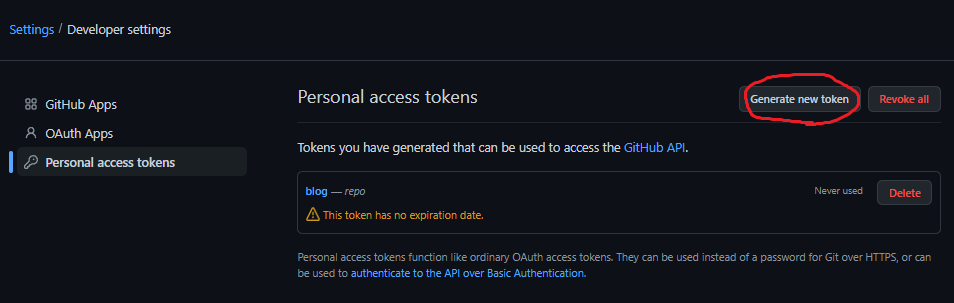
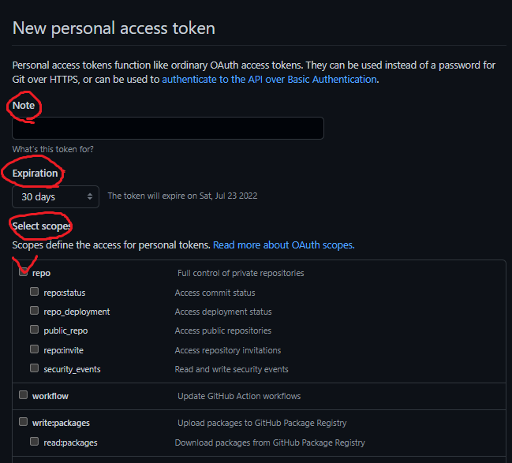
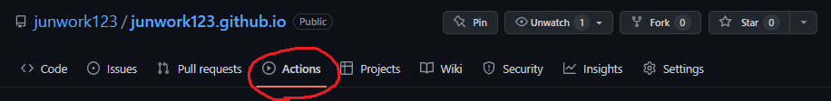
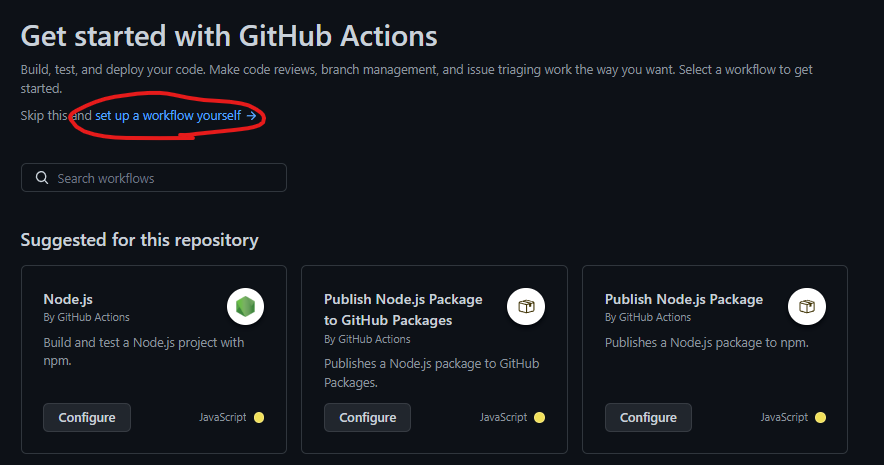

## **자동 배포 권한을 얻기 위한 토큰 생성**

먼저 GitHub 계정의 [Developer settings](https://github.com/settings/apps) 메뉴에서 토큰(Personal access tokens)을 만들어야 한다.



<br/><br/>

`Generate new token` 버튼을 누르게 되면,

아래와 같은 화면이 나타나지만 어려울 것 하나없다!



- Note : 이 토큰의 목적(설명)

- Expiration : 토큰의 만료기간(최소 7일 / Custom - 년도지정 / No Expiration - 무제한)

- Select scopes : 이 토큰으로 할 수 있는 활동들(우리는 `repo`만 체크해도 된다.)

<br/><br/>

---

## **GitHub Action에서 yml 스크립트 작성하기**

<br/>

이제 배포할 `repogitory의 actions 메뉴`로 가보자.






스크린샷 처럼 `set up a workflow yourself` 메뉴를 누르면

드디어 최종장에 돌입하게 된다. ~~필자는 이 메뉴 찾는데 10분이나 걸렸다~~

결론적으로 GitHub Action을 통한 자동 배포는

yml 스크립트를 작성해야 한다.

> 배울게 또 늘어나? 😵

싶겠지만(~~싫겠지만~~) 생각외로 간단하니 조금만 더 읽어보자.

(바로 적용하고 싶다면 설명은 건너뛰고 [실제 반영 코드](#code) 위주로 보아도 좋다)

예시를 통해 각 키워드마다 의미를 빠르게 파악하고 응용하자.

```yml
    name: Blog Deployment # 이 스크립트의 제목

    # 어떤 행동을 할때마다 실행할지
    on: 
        # master, release/v*라는 이름의 브랜치에 push가 발생할 때마다
        # ex) release/v0.1, release/v2.1.5
        push:
            branches: 
                - master
                - release/v*
        
        # gh-pages 브랜치에 pull_request가 발생할 때마다
        pull_request:
            branches: 
                - gh-pages

        # cron 표현식으로 `UTC 기준 매일 월~금 오전2시에 실행`
        schedule: 
            - cron: "0 0 2 ? * MON-FRI *"

        # 직접 "Run workflow"버튼을 누를때만 실행
        workflow_dispatch: 

    # 실행할 작업을 정의
    jobs:
        # 'build'라는 이름의 job은 (job이름은 맘대로 적어도 됨)
        # 'Checkout, Install, Build'라는 이름의 작업을
        # 우분투 최신버전에서 동작시킨다.
        # 동작내용은 
        # [브랜치 체크아웃 
        #   > 패키지 설치 
        #   > 빌드 
        #   > 메시지 출력
        #   > 도메인 복사
        #   > 배포] 순으로 진행된다.

        build: 
            runs-on: ubuntu-latest

            name: Checkout, Install, Build

            # 다음 동작을 순서대로 실행
            steps:
                # 'uses' == 누군가 미리 정의된 workflow@version 사용
                # 'master' 브랜치를 체크아웃()
                - name: Checkout branche
                  uses: actions/checkout@master
                
                # 패키지 설치 동작 
                # [node 설치 
                #   > 의존성 캐시검사 
                #   > (변화가 있다면) npm설치] 순으로 동작
                - name: Use Node.js
                  uses: actions/setup-node@master
                  with:
                      node-version: 16.x

                - name: Cache node modules
                  uses: actions/cache@v2
                  id: cache
                  with:
                      path: node_modules
                      key: npm-packages-${{ hashFiles('**/package-lock.json') }}

                - name: Install Dependencies
                  if: steps.cache.outputs.cache-hit != 'true'
                  run: npm install

                # 빌드 실행
                - name: Build
                  run: npm run build
                    
                # 도메인 설정파일을 빌드결과물에 복사
                - name: copy Cname
                  run: cp CNAME public/ 

                # 특정 유저의 배포 액션을 이용하여
                # 빌드 결과물을 배포 경로에 복사한다.
                - name: Deploy changes
                  uses: peaceiris/actions-gh-pages@v3 
                  with:
                      github_token: ${{ secrets.GITHUB_TOKEN }}
                      publish_dir: ./public
```


## 반영된 실제 yml 코드 <span id="code"></span> 

위에 예제로 적은 코드는 bad indentation 경고가 발생하므로 일부 수정하여 반영.

```yml
    name: Blog Deployment
    on: 
        push:
            branches: 
                - master

    jobs:
        build: 
            runs-on: ubuntu-latest
            name: Checkout, Install, Build
            steps:
                - name: Checkout branche
                  uses: actions/checkout@master

                - name: Use Node.js
                  uses: actions/setup-node@master
                  with:
                    node-version: 16.x

                - name: Cache node modules
                  uses: actions/cache@v2
                  id: cache
                  with:
                    path: node_modules
                    key: npm-packages-${{ hashFiles('**/package-lock.json') }}

                - name: Install Dependencies
                  if: steps.cache.outputs.cache-hit != 'true'
                  run: npm Install

                - name: Build
                  run: npm run build
                    
                - name: copy Cname
                  run: cp CNAME public/ 

                - name: Deploy changes
                  uses: peaceiris/actions-gh-pages@v3 
                  with:
                    github_token: ${{ secrets.GITHUB_TOKEN }}
                    publish_dir: ./public
```


더 자세한 내용은 아래를 참조하자

> [많은 도움이 된 블로그](https://dailyco.tech/share/gatsby-blog-auto-deploy/)

> [카카오웹툰은 GitHub Actions를 어떻게 사용하고 있을까?](https://fe-developers.kakaoent.com/2022/220106-github-actions/)

> [Actions의 표현식](https://docs.github.com/en/actions/learn-github-actions/expressions)

> [Actions의 이벤트](https://docs.github.com/en/actions/using-workflows/events-that-trigger-workflows)

> [cron 표현식](cron.png) // 이건 여러군데서 쓰이니 알아두면 좋을거야!


```toc

```